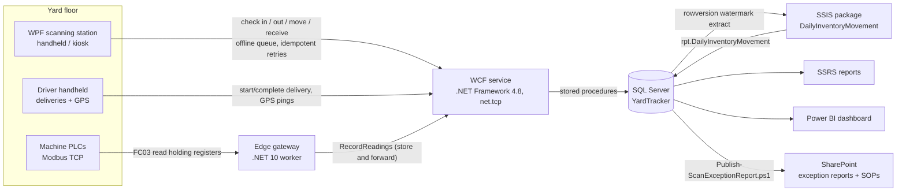

# YardTracker: yard and inventory asset tracking

YardTracker tracks pipe and steel inventory as it moves through a yard. Operators on wireless handhelds scan tagged bundles in and out. Trucks move stock between sites while reporting GPS positions. Plant machines report temperature and status over Modbus TCP. Everything lands in SQL Server, where an SSIS package rolls it up for SSRS reports and a Power BI dashboard, and a daily scan exception report is published to SharePoint.

It is a working, end-to-end model of an industrial floor system:

- rugged client apps talking to a central service over the plant network
- a relational back end with a scan audit trail
- ETL into reporting tables
- operational and executive reporting on top



## How the pieces map to the stack

| Technology | Component | Where |
|---|---|---|
| WPF | Scanning station: badge sign-in, check in / out / move / receive / lookup, keyboard-wedge barcode input, simulated RFID reads, offline queue, fleet map, machine tiles | [src/YardTracker.Station](src/YardTracker.Station) |
| WCF | Self-hosted `ServiceHost` on .NET Framework 4.8 with `netTcpBinding` (Windows transport security): `IInventoryService`, `ILogisticsService`, `ITelemetryService`, typed faults, MEX endpoint | [src/YardTracker.Service](src/YardTracker.Service), [src/YardTracker.Contracts](src/YardTracker.Contracts) |
| SQL Server | Schema (Items, Locations, ScanEvents, Operators, Stations, Products, deliveries, GPS, telemetry), stored procedures with row locking and idempotency, reporting views | [database](database) |
| SSIS | `DailyInventoryMovement.dtsx`: Execute SQL (begin run) → Data Flow (OLE DB source → fast-load staging) → Execute SQL (merge) with an OnError handler | [etl/ssis](etl/ssis/YardTracker.ETL) |
| SSRS | Current Inventory by Location, Items Overdue for Movement, Daily Yard Throughput (RDL 2016) | [reports/ssrs](reports/ssrs/YardTracker.Reports) |
| Power BI | Power BI Project (PBIP): TMDL semantic model with 33 measures + 3-page PBIR report | [powerbi](powerbi) |
| SharePoint | PnP PowerShell provisioning (library, list, SOP library) and a daily exception report publisher | [sharepoint](sharepoint) |
| GPS (stretch) | Truck deliveries with mock GPS pings, shown on a live map in the WPF client and in Power BI | `ILogisticsService`, Simulator `trucks` |
| Industrial protocol (stretch) | Modbus TCP client/server written from the spec, PLC simulator, edge gateway feeding SQL and Power BI | [src/YardTracker.Modbus](src/YardTracker.Modbus), [src/YardTracker.EdgeGateway](src/YardTracker.EdgeGateway) |

## Quick start

Prerequisites: Windows, .NET 10 SDK, .NET Framework 4.8 (built into Windows 11) with its targeting pack (Visual Studio "Managed desktop" workload), and SQL Server or SQL Server Express LocalDB.

```powershell
# 1. Database (creates YardTracker on (localdb)\MSSQLLocalDB; no sqlcmd needed)
.\scripts\Deploy-Database.ps1 -Force

# 2. Build everything
dotnet build YardTracker.slnx

# 3. Generate 60 days of realistic history and run the ETL once
dotnet run --project src\YardTracker.Simulator -- backfill --days 60

# 4. Start the WCF service (keep this window open)
.\src\YardTracker.Service\bin\Debug\net48\YardTracker.Service.exe

# 5. Start a scanning station and sign in with badge 1001 (operator), 2001 (supervisor) or 3001 (driver)
dotnet run --project src\YardTracker.Station -- --station HH-01
```

Optional live data, each in its own terminal:

```powershell
dotnet run --project src\YardTracker.Simulator -- traffic --rate 1      # handheld scans, misreads, wireless retries
dotnet run --project src\YardTracker.Simulator -- trucks --trucks 2     # deliveries with GPS pings (watch the Fleet map tab)
dotnet run --project src\YardTracker.Simulator -- plc --port 5020       # Modbus TCP PLC simulator
dotnet run --project src\YardTracker.EdgeGateway                        # polls the PLC, forwards readings (Machines tab)
.\scripts\Run-Etl.ps1                                                   # incremental ETL (or -UseSsis with SSIS installed)
.\sharepoint\Publish-ScanExceptionReport.ps1 -LocalOnly                 # daily exception report to .\out\sharepoint
```

To try the offline queue, stop the service while the station is signed in and keep scanning. Scans are saved on the device ("Offline, n pending") and sync with their original timestamps when the service is back.

## Components

### WPF scanning station
- Large touch targets and a dark, high-contrast theme for industrial displays.
- Keyboard-wedge scanners type into the scan box. If focus is elsewhere, keystrokes are rerouted so a read is never lost. `LOC:` labels switch the target location and `BADGE:` labels are recognised.
- **Simulate RFID read** stands in for reader hardware and picks a tag that suits the current mode.
- Every scan carries a client-generated `ClientScanId` and device timestamp. If the service is unreachable, the scan goes into a disk-backed queue and is replayed in order.
- Tabs: Scan, Inventory (by location with utilization, items, open exceptions), Fleet map (live GPS trails), Machines (Modbus telemetry tiles).

### WCF service
- Per-call, concurrency-multiple service. Every operation goes through one wrapper that logs timing and turns exceptions into `FaultException<ServiceFault>` (codes `Validation`, `Rejected`, `Unavailable`, `Internal`). No stack traces reach the client.
- A rejected scan (unknown tag, item already checked out, wrong site) is a normal `ScanResult`, not a fault. Faults are for broken requests and infrastructure failures.
- Clients use cached `ChannelFactory` instances with a new channel per call, aborting faulted channels ([YardTrackerClient.cs](src/YardTracker.Client/YardTrackerClient.cs)).

### Database
- `dbo.usp_RecordScan` implements the item state machine under `UPDLOCK, HOLDLOCK`, deduplicates on `ClientScanId`, and logs rejections to `dbo.ScanExceptions`.
- Deliveries validate the whole load (state, site, truck payload) atomically. GPS pings attach to the truck's active delivery.
- `rpt.*` views form a star schema for Power BI. `rpt.usp_*` procedures back the SSRS datasets.

### ETL (SSIS + stored procedures)
- Watermark on `ScanEvents.RowVer` (rowversion) bounded by `MIN_ACTIVE_ROWVERSION()`, so in-flight transactions and scans that arrive hours late (offline handhelds) are neither skipped nor double counted.
- The merge rebuilds only the (business day, location) cells touched by new events, using delete + insert in one transaction. Business days are plant-local (`AT TIME ZONE`).
- The SSIS package and `etl.usp_LoadDailyInventoryMovement` share the same extract function and merge procedure, so the logic is tested even without SSIS.

### Modbus TCP and edge gateway
- MBAP framing, FC03 and FC06 are implemented directly with no library ([ModbusFrame.cs](src/YardTracker.Modbus/ModbusFrame.cs)). The server maps unit ids to devices, the way a TCP-to-RTU gateway fronts serial PLCs.
- Register map: 40001 temperature ×10 (int16), 40002 state, 40003-40004 cycle count (uint32), 40005 fault code, 40011 fault reset. See [docs/architecture.md](docs/architecture.md#modbus-register-map).
- The gateway loads the machine list from the service, polls every 5 s, and buffers readings while the service is down (store and forward).

## Repository layout

```
database/                 SQL scripts, run in order by scripts/Deploy-Database.ps1
src/
  YardTracker.Contracts/  WCF service and data contracts (net48 + net10.0), scan code parsing
  YardTracker.Service/    WCF host (.NET Framework 4.8)
  YardTracker.Client/     WCF client plumbing (.NET 10)
  YardTracker.Station/    WPF scanning station (.NET 10)
  YardTracker.Modbus/     Modbus TCP client/server
  YardTracker.EdgeGateway/ Modbus poller -> WCF (worker service)
  YardTracker.Simulator/  backfill, live traffic, trucks, PLC simulator
tests/YardTracker.Tests/  unit + LocalDB integration tests (xUnit v3)
etl/ssis/                 SSIS package
reports/ssrs/             SSRS project, shared data source, 3 reports
powerbi/                  Power BI Project (open YardTracker.pbip in Power BI Desktop)
sharepoint/               PnP provisioning, exception report publisher, SOP
scripts/                  Deploy-Database.ps1, Run-Etl.ps1
docs/                     architecture and design notes
```

## Tests

```powershell
dotnet test tests\YardTracker.Tests
```

42 tests, all of which must pass:

- **Modbus:** byte-exact frames, exception responses, loopback client/server, register encoding.
- **Parsing and contracts:** scanner input parsing, and WCF contract shape (every operation declares the fault contract).
- **Database integration:** the test fixture deploys the real scripts into a throwaway `YardTracker_Test` LocalDB database. Tests cover the idempotent retry, the item state machine, rejected-scan logging, site rules, deliveries, incremental ETL with late-arriving scans, overdue grading and telemetry.

## Verification status

| Piece | How it was verified |
|---|---|
| Database scripts and procedures | Deployed to LocalDB; integration tests; smoke scripts |
| WCF service, client, station | Built; service run with the station, simulators and gateway against it; station UI exercised |
| Modbus, gateway, simulator | Live PLC simulator → gateway → WCF → SQL, 5 s readings confirmed in the database |
| ETL (stored procedure path) | Integration tests plus runs over backfilled and live data |
| SSRS reports | Rendered to PDF with the ReportViewer engine (ReportViewerCore) against live data. Not yet deployed to a report server |
| SSIS package | Generated with a structural check (lineage, paths, connections, precedence). **Not yet opened in the SSIS designer or run with dtexec** |
| Power BI project | TMDL loaded and round-tripped with the Analysis Services `TmdlSerializer`; report JSON validated against the Fabric PBIR schemas. **Not yet opened in Power BI Desktop** |
| SharePoint | Publisher run with `-LocalOnly`. **Upload and provisioning not run against a tenant** |

## Deployment notes
- **SSRS:** LocalDB is per-user and cannot be reached by the Report Server service. Point `YardTracker.rds` at a full SQL Server instance.
- **SSIS:** the package uses the Microsoft OLE DB Driver 19 (`MSOLEDBSQL19`). Add it to a new Integration Services project with *Add Existing Package*, or run it with `.\scripts\Run-Etl.ps1 -UseSsis`.
- **Power BI:** open `powerbi/YardTracker.pbip`. The `SqlServer` and `SqlDatabase` parameters point at LocalDB by default. The map visual needs map visuals enabled in Options > Security.
- **WCF:** the host opens TCP 8523 (services) and 8524 (metadata). For handhelds on another machine, open the firewall and use certificate or domain credentials (see comments in `App.config`).

## Documentation

[docs/README.md](docs/README.md) is the full documentation set: a 13-part guide covering the
purpose of the project, every folder and file, the database object by object, the service and
contracts, the station, Modbus and the gateway, the simulator, the ETL, both reporting stacks,
SharePoint, build/run/test/deploy, four end-to-end walkthroughs, and a glossary.

Shorter references: [docs/architecture.md](docs/architecture.md) (processes, ports, ER diagram,
register map) and [docs/talking-points.md](docs/talking-points.md) (the design decisions, phrased
for a demo).
