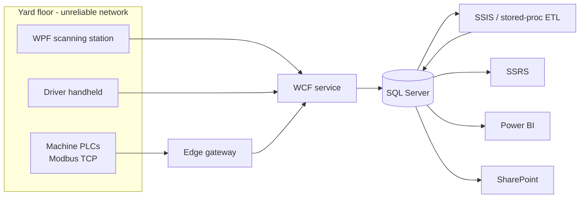

# 1. Project overview

## What it is

YardTracker is a complete, working model of the software a pipe-and-steel **yard** runs on.

A yard is an outdoor industrial warehouse. Instead of boxes on shelves it holds bundles of
line pipe, casing, tubing, plate, beams and bar stock, sitting on racks and laydown areas
across several sites. Material arrives from a mill, gets put away, gets moved around, gets
trucked to a plant for coating or threading, and eventually leaves on a work order.

The system tracks every one of those movements in real time, and turns that movement log
into operational reports and an executive dashboard.

## The problem it solves

Without tracking, a yard has four chronic and expensive failures:

| Problem | Cost | What YardTracker does about it |
|---|---|---|
| "Where is that bundle?" | Crews walk the yard hunting for material; jobs wait | Every item has a current location, updated by scan, queryable instantly |
| Stock sits and ages | Capital tied up in steel nobody remembers; surface rust; re-inspection | Items Overdue for Movement report, aging buckets, days-idle measures |
| Nobody knows the throughput | Cannot staff shifts, cannot justify capacity spend | Daily movement roll-up: receipts, check-outs, moves, tons in and out per day |
| Traceability gaps | For steel, a bad **heat** (a single melt at the mill) may need a recall. Without records you cannot say which bundles came from it or who touched them | `HeatNumber` on every item, plus an insert-only `ScanEvents` log with operator, station and reference |

On top of that, a yard is a hostile computing environment: wireless dead spots behind stacks
of pipe, handhelds with dying batteries, scanners that misread, machines that speak only
industrial protocols. A design that assumes a reliable network produces **lost scans**
(material that "does not exist") or **double-counted scans** (material in two places). Most of
the engineering in this project exists to make both impossible.

## Who uses it

| Role | Touchpoint | What they get |
|---|---|---|
| Yard operator | WPF station on a wireless handheld or kiosk | Receive, check in, check out, move, look up, with a green or red banner per scan |
| Driver | Same station app, driver badge | Load a truck, report position, unload at the destination site |
| Yard supervisor | SSRS reports plus the SharePoint exception list | What is where, what has not moved, which scans were rejected and why |
| Plant / operations manager | Power BI dashboard | Utilization, throughput trend, bottleneck dwell times, machine uptime |
| Maintenance | Machines tab on the station, Power BI machine page | Live temperature, state and fault codes from the floor |
| IT / integration | Edge gateway, ETL, SharePoint scripts | Automatable, scheduled, logged |

## The shape of the system

Five tiers, each with a clear job:

1. **Capture** (station, driver handheld, PLCs) — record what physically happened, and survive a
   network that is not there.
2. **Service** (WCF over `net.tcp`) — one validated, logged, authenticated door into the data.
3. **Store** (SQL Server) — enforce the business rules transactionally, keep an immutable history.
4. **Transform** (ETL) — turn an event log into a daily summary that is cheap to report on.
5. **Present** (SSRS, Power BI, SharePoint) — operational, executive and exception views.

## Why this technology stack

The stack was chosen to look like what a real plant actually runs, not what a greenfield web
project would pick.

| Choice | Why |
|---|---|
| **WPF** for the floor client | Plant handhelds and kiosks are Windows. A rich desktop client works offline, handles keyboard-wedge scanner input, and can be made touch-friendly with large targets and a high-contrast dark theme readable in daylight |
| **WCF on .NET Framework 4.8** | What plants with an existing middle tier actually run. Keeping it classic makes the migration story honest: modern clients first, server later |
| **`netTcpBinding`** | Binary framing over TCP, transport security with Windows credentials, no certificate to manage on a domain. Much cheaper per call than HTTP/SOAP for a chatty handheld |
| **Stored procedures, no ORM** | The transactional operations are few and well defined. Procedures give explicit row locking, one round trip per scan, and a clean permission boundary (`EXECUTE` on a schema, no table rights) |
| **SSIS + SSRS** | The reporting stack a SQL Server shop already owns, already schedules and already knows how to operate |
| **Power BI (PBIP)** | The modern layer on the same database, stored as text (TMDL plus PBIR JSON) so it can be diffed and reviewed like code |
| **Modbus TCP written from the spec** | The floor protocol. Implementing MBAP framing directly, with no library, shows exactly how the bytes work and keeps the dependency surface at zero |
| **SharePoint via PnP PowerShell** | Where supervisors already live. The daily exception report lands as a document plus a worklist they can triage |

## The four ideas that hold it together

If you remember only four things about the design, remember these.

### 1. Idempotency, end to end

The handheld generates a `ClientScanId` (a GUID) the moment the tag is read. Every retry of that
scan reuses it. `dbo.usp_RecordScan` looks it up first and returns the original answer instead of
moving the item again; a unique constraint catches two retries racing each other.

That is "at-least-once delivery plus an idempotent receiver" — the practical way to get
exactly-once behaviour on a lossy network.

### 2. Offline first on the device

A connectivity failure (as opposed to a fault the service returned) puts the scan into a
disk-backed JSON queue, written atomically, replayed in order every ten seconds. New scans queue
behind older ones so a `Move` can never be applied before the `Receive` it depends on, and each
scan keeps its **original device timestamp**, so history shows when the steel actually moved.

### 3. A rejection is data, not an error

"That item is already checked out" is a normal shop-floor event. It comes back as a `ScanResult`
with `Outcome = Rejected`, is written to `dbo.ScanExceptions`, and becomes a supervisor worklist
and an exception-rate metric.

`FaultException<ServiceFault>` is reserved for broken requests and infrastructure failures, and
carries a correlation id instead of a stack trace. Clients therefore need no try/catch for normal
flow, and the exception log becomes genuinely useful data.

### 4. An ETL that survives late data

The watermark is `rowversion`, not a timestamp, because device time is not arrival order — a
handheld out of Wi-Fi for two hours delivers old timestamps. The upper bound is
`MIN_ACTIVE_ROWVERSION() - 1`, so an open transaction cannot commit rows behind the watermark.
The merge rebuilds only the (business day, location) cells the new events touch, from the full
log, with delete plus insert in one transaction — idempotent, self-correcting, rerunnable.

## What is verified and what is not

| Piece | Status |
|---|---|
| Database scripts and procedures | Deployed to LocalDB, covered by integration tests |
| WCF service, client, station | Built and run together with the simulators and the gateway |
| Modbus, gateway, PLC simulator | Live end to end: simulator to gateway to WCF to SQL |
| ETL (stored-procedure path) | Integration tests plus runs over backfilled and live data |
| SSRS reports | Rendered to PDF against live data. **Not deployed to a report server** |
| SSIS package | Generated and structurally checked. **Not opened in the designer or run with `dtexec`** |
| Power BI project | TMDL round-tripped, report JSON schema-validated. **Not opened in Power BI Desktop** |
| SharePoint | Publisher run with `-LocalOnly`. **Not run against a tenant** |

Next: [02-repository-map.md](02-repository-map.md)
