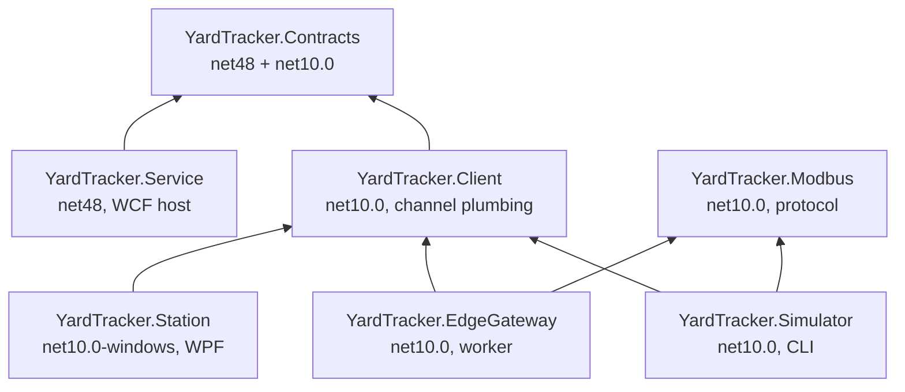

# 2. Repository map

Every folder and every file that matters, with its purpose. Build output (`bin/`, `obj/`,
`.vs/`, `out/`) is generated and ignored by git.

## Top level

| Path | What it is | Why it exists |
|---|---|---|
| `YardTracker.slnx` | XML solution file (the modern, terse replacement for `.sln`) | Groups the seven `src/` projects and the test project so `dotnet build YardTracker.slnx` builds everything |
| `Directory.Build.props` | MSBuild properties applied to every project | One place for `LangVersion`, `Nullable`, company/product/version metadata. Avoids repeating them in eight `.csproj` files |
| `.gitignore` | Ignore rules | Excludes build output, Visual Studio state, Power BI local cache, SSIS/SSRS designer state, and the generated `out/` and `graphify-out/` folders |
| `README.md` | Quick start and component tour | The entry point for anyone opening the repository |
| `database/` | SQL scripts | The schema and all business logic |
| `src/` | .NET projects | Service, clients, protocol, gateway, simulator |
| `tests/` | xUnit v3 test project | Unit plus LocalDB integration tests |
| `etl/` | SSIS package | Scheduled incremental load |
| `reports/` | SSRS project | Operational reporting |
| `powerbi/` | Power BI Project (PBIP) | Executive dashboard, stored as text |
| `sharepoint/` | PnP PowerShell plus an SOP | Exception publishing and floor documentation |
| `scripts/` | PowerShell operations scripts | Deploy the database, run the ETL |
| `docs/` | This documentation | Design, reference, walkthroughs |
| `out/` | Generated report output (git-ignored) | Where `-LocalOnly` publishing writes the daily exception report |

## `database/` — the SQL layer

Scripts are numbered and run in order by `scripts/Deploy-Database.ps1`. Order matters: tables
before the procedures that reference them, procedures before the seed script that calls one.

| File | Size | Contents | Purpose |
|---|---|---|---|
| `01_schema.sql` | ~20 KB | Five schemas, 20 tables, indexes, check constraints, three table-valued parameter types | The complete data model. Constraints encode rules the application can never violate, for example "an item has a yard location only while it is `InYard`" |
| `02_operations.sql` | ~40 KB | 2 views, 24 stored procedures across `dbo`, `logistics` and `telemetry` | Every OLTP operation the WCF service performs. This is where the business logic lives |
| `03_etl_reporting.sql` | ~24 KB | 1 table-valued function, 5 ETL procedures, 10 reporting views, 6 SSRS/publisher dataset procedures | The incremental load and the reporting layer |
| `04_seed.sql` | ~7 KB | Reference data: 3 sites, 20 locations, 9 operators, 7 stations, 10 products, 3 trucks, 4 machines, plus a date dimension for 2025-2027 | Everything a yard has before any material arrives. Inventory itself is generated by the simulator |

See [03-database.md](03-database.md) for the object-by-object reference.

## `src/` — the .NET projects

Seven projects. The dependency direction is strictly one way: everything points at `Contracts`.

| Project | Target | Role | Key files |
|---|---|---|---|
| `YardTracker.Contracts` | `net48` **and** `net10.0` | The shared vocabulary: three `[ServiceContract]` interfaces, ~25 `[DataContract]` types, scanner input parsing | `ServiceContracts.cs`, `DataContracts.cs`, `ScanCodes.cs` |
| `YardTracker.Service` | `net48` | The self-hosted WCF service. Validates, calls stored procedures, maps results, logs, converts exceptions into typed faults | `Program.cs`, `YardTrackerService.cs`, `Infrastructure.cs`, `Data/Db.cs`, `Data/Mapping.cs`, `App.config` |
| `YardTracker.Client` | `net10.0` | WCF client plumbing: cached `ChannelFactory` per contract, a fresh channel per call, connectivity-failure detection | `YardTrackerClient.cs` |
| `YardTracker.Station` | `net10.0-windows` (WPF) | The scanning station operators use | `App.xaml.cs`, `MainWindow.xaml`, `Views/*`, `ViewModels/*`, `Services/StationServices.cs`, `Theme.xaml`, `station.json` |
| `YardTracker.Modbus` | `net10.0` | Modbus TCP client and server implemented from the specification, plus the machine register map | `ModbusFrame.cs`, `ModbusTcpClient.cs`, `ModbusTcpServer.cs`, `MachineRegisterMap.cs` |
| `YardTracker.EdgeGateway` | `net10.0` | Worker service (installable as a Windows service): polls PLCs, decodes, forwards to WCF, buffers while the service is down | `Program.cs`, `ModbusPollingWorker.cs`, `appsettings.json` |
| `YardTracker.Simulator` | `net10.0` | Four CLI commands that produce realistic data: `backfill`, `traffic`, `trucks`, `plc` | `Program.cs`, `BackfillCommand.cs`, `TrafficCommand.cs`, `TruckCommand.cs`, `PlcCommand.cs`, `MachineModel.cs`, `Common.cs` |

### Why `Contracts` is multi-targeted

`net48` is referenced by the WCF service host (classic `System.ServiceModel` from the GAC).
`net10.0` is referenced by the station, gateway and simulator (the `System.ServiceModel.Primitives`
NuGet package, the dotnet/wcf client libraries). One source file set, two builds, so contract
drift between server and client is impossible.

## `tests/YardTracker.Tests`

xUnit v3, `net10.0`. Three files, 42 tests.

| File | Covers |
|---|---|
| `ModbusTests.cs` | Byte-exact frame layout, big-endian parsing, exception responses, quantity validation, two's-complement temperatures, a real loopback client/server over TCP, timeout on an unreachable device |
| `ContractTests.cs` | Scanner input classification, `NormalizeTag` rejecting location labels, and reflection over the service contracts: every operation declares the fault contract, wire names drop the `Async` suffix, the scan operations are named after the yard actions |
| `DatabaseTests.cs` | A fixture that deploys the real `database/*.sql` into a throwaway `YardTracker_Test` LocalDB database, then exercises idempotent retries, the item state machine, rejected-scan logging, site rules, deliveries, incremental ETL with late-arriving scans, overdue grading and telemetry |

The database tests **skip** rather than fail when LocalDB is not installed.

## `etl/ssis/YardTracker.ETL`

| File | Purpose |
|---|---|
| `DailyInventoryMovement.dtsx` | The SSIS package: Execute SQL "Begin run" → Data Flow "Extract scan events" (OLE DB source → fast-load into `etl.stg_ScanEvents`) → Execute SQL "Merge daily movement", with an OnError handler "Mark run failed". Package variables `ServerName`, `DatabaseName`, `RunId`, `FromRowVersion`, `ToRowVersion`, `ExtractQuery` |

The package and `etl.usp_LoadDailyInventoryMovement` call the **same** extract function and merge
procedure, so the logic is exercised by tests even without SSIS installed.

## `reports/ssrs/YardTracker.Reports`

| File | Purpose |
|---|---|
| `YardTracker.Reports.rptproj` | The Report Server project |
| `YardTracker.rds` | Shared data source. Points at LocalDB by default; retarget it at a full instance before deploying, because LocalDB is per-user and unreachable by the Report Server service |
| `CurrentInventoryByLocation.rdl` | What is where now, with capacity utilization and conditional formatting |
| `ItemsOverdueForMovement.rdl` | Stock that has not moved, graded Overdue / Critical |
| `DailyThroughput.rdl` | Daily scan counts and tonnage, with a chart |

All three take a site parameter driven by `rpt.usp_SiteList` and read from a matching
`rpt.usp_*` dataset procedure. RDL 2016 schema.

## `powerbi/`

A **PBIP** (Power BI Project): the report and model as reviewable text rather than a binary `.pbix`.

| Path | Purpose |
|---|---|
| `YardTracker.pbip` | The project file Power BI Desktop opens |
| `YardTracker.SemanticModel/definition/*.tmdl` | The model in TMDL: `model.tmdl`, `relationships.tmdl` (13 relationships), `expressions.tmdl` (the `SqlServer` and `SqlDatabase` parameters), and one file per table under `tables/` |
| `YardTracker.Report/definition/` | The report in PBIR JSON: `pages/pages.json` plus one folder per page, each holding `page.json` and a `visuals/<name>/visual.json` per visual |
| `YardTracker.Report/StaticResources/RegisteredResources/YardTracker-theme.json` | The report theme |

Eleven tables, 33 measures, three pages: Yard Overview, Flow & Bottlenecks, Machines & Trucks.

## `sharepoint/`

| File | Purpose |
|---|---|
| `Provision-SharePoint.ps1` | Creates the site structure with PnP PowerShell: a "Scan Exception Reports" document library, a "Scan Exceptions" list with typed columns, and a "Yard SOPs" library it uploads `sop/*` into. Idempotent — re-running it is safe |
| `Publish-ScanExceptionReport.ps1` | The daily job: read one business day from `rpt.usp_ScanExceptionReport`, render HTML and CSV, upload both, add each exception to the list (skipping ones already there), and mark them published in SQL. `-LocalOnly` writes to `out/sharepoint` without touching a tenant |
| `sop/SOP-101-Scanning-Check-In-Check-Out.md` | The operator standard operating procedure: shift start, receive, move, check out, check in, what to do about each rejection banner |

## `scripts/`

| File | Purpose |
|---|---|
| `Deploy-Database.ps1` | Creates the database and runs every `database/*.sql` in name order. Splits batches on `GO` the way `sqlcmd` does, using the `SqlClient` built into Windows PowerShell, so no `sqlcmd` or SSMS is needed. Enables `READ_COMMITTED_SNAPSHOT`. `-Force` drops an existing database first |
| `Run-Etl.ps1` | Runs `etl.usp_LoadDailyInventoryMovement` by default, or the SSIS package with `-UseSsis`, then prints the last five rows of `etl.RunLog` |

## `docs/`

| File | Purpose |
|---|---|
| `README.md` | Index and reading order |
| `01-` … `13-` | This documentation set |
| `architecture.md` | Condensed reference: processes and ports, ER diagram, state machine, ETL flow, register map, WCF configuration notes |
| `talking-points.md` | The ten design decisions plus likely questions, phrased for a demo or interview |

Next: [03-database.md](03-database.md)
