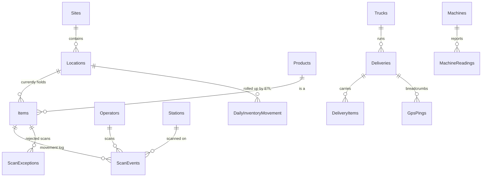
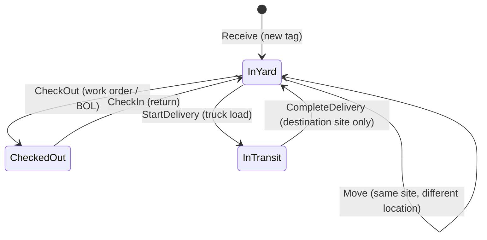

# 3. The database

SQL Server is not a passive store in this system. It is where the business rules are
enforced, where concurrency is resolved, and where the audit trail is guaranteed.

## The five schemas and why they are separate

| Schema | Holds | Written by | Reason it is its own schema |
|---|---|---|---|
| `dbo` | Sites, Locations, Operators, Stations, Products, Items, ScanEvents, ScanExceptions | The WCF service, on every scan | The core OLTP surface |
| `logistics` | Trucks, Deliveries, DeliveryItems, GpsPings | The WCF service, on delivery and GPS calls | Inter-site movement is a separate concern with its own lifecycle and its own service contract |
| `telemetry` | Machines, MachineStatuses, MachineReadings | The edge gateway, in batches | High-volume, low-value-per-row data. Isolating it makes it easy to move to a time-series store later without touching inventory |
| `etl` | Watermarks, RunLog, stg_ScanEvents | The SSIS package or the load procedure | Control and staging, never read by the application |
| `rpt` | DimDate, DailyInventoryMovement, plus views and dataset procedures | The ETL merge | The reporting contract. SSRS and Power BI touch only `rpt`, so the OLTP tables can change shape without breaking a report |

Schema separation is also the permission boundary: the service account needs `EXECUTE` on
`dbo`, `logistics` and `telemetry` and nothing else — no table rights at all.

## Conventions that apply everywhere

- **Every timestamp is UTC**, named with a `Utc` suffix. There is no ambiguity about what is
  stored.
- **Business-day reporting converts explicitly** with `AT TIME ZONE` using `Sites.TimeZoneId`,
  so a 9 pm scan in Houston counts for that day, not the next UTC day.
- **`ScanEvents` is insert-only.** `Items` holds current state; `ScanEvents` holds how it got
  there. Nothing ever updates or deletes an event.
- **`ClientScanId` is generated on the device**, not the server, which is what makes retries
  over a flaky wireless link idempotent.

## Entity relationships



## Table reference

### Reference data (`dbo`)

| Table | Key columns | Purpose and design notes |
|---|---|---|
| `Sites` | `SiteCode`, `Latitude`, `Longitude`, `TimeZoneId` | The three physical sites. Coordinates drive the fleet map; `TimeZoneId` drives business-day conversion. Every site can be in a different time zone and reporting still works |
| `Locations` | `LocationCode`, `LocationType`, `CapacityTons` | A place inside a site. `LocationType` is constrained to `Rack`, `Laydown`, `Bay`, `Dock`, `Staging`, `Quarantine` — the type is what makes bottleneck analysis possible (dock, bay, staging and quarantine are the "process" locations). `CapacityTons` gives utilization a denominator |
| `Operators` | `BadgeNumber`, `Role` | Who can scan. `Role` is `Operator`, `Supervisor` or `Driver`. `IsActive = 0` on a former employee means their badge is rejected with `UnknownOperator`, which the seed data deliberately includes (badge 1099) so that rejection path is demonstrable |
| `Stations` | `StationCode`, `DeviceType`, `DefaultLocationId`, `LastSeenAtUtc` | A scanning device: `Handheld`, `FixedReader` (an RFID portal at a gate) or `Kiosk`. `DefaultLocationId` pre-selects the right location so an operator at the receiving dock does not have to pick it every scan. `LastSeenAtUtc` is stamped on every scan, giving a free device-health signal |
| `Products` | `ProductCode`, `Category`, `Grade`, `NominalLengthFt`, `WeightLbsPerFt` | The catalogue. `Category` (`Pipe`, `Casing`, `Tubing`, `Plate`, `Beam`, `Bar`) is the reporting grain. `WeightLbsPerFt` lets weight be derived from length rather than entered and mistyped |

### Inventory (`dbo`)

**`Items`** — one tagged physical unit: a bundle of pipe joints, a plate, a beam.

| Column group | Why |
|---|---|
| `TagId` (unique) | The barcode value or RFID EPC physically on the tag. The only identifier an operator ever sees |
| `HeatNumber` | The mill melt this steel came from. This single column is the traceability story: "where is every bundle from heat K7781, and who touched it?" |
| `Pieces`, `TotalLengthFt`, `WeightLbs` | Quantity, all `CHECK`ed positive |
| `Status` | `InYard`, `CheckedOut` or `InTransit` |
| `CurrentLocationId` | Where it is, **only** while `InYard` |
| `LastMovedAtUtc` | Drives every aging and overdue calculation |
| `RowVer` (`rowversion`) | Optimistic-concurrency token |

The important constraint is `CK_Items_LocationMatchesStatus`:

```sql
(Status = 'InYard' AND CurrentLocationId IS NOT NULL) OR
(Status <> 'InYard' AND CurrentLocationId IS NULL)
```

An item that has left the yard cannot also claim a rack. No application bug can produce that row.

**`ScanEvents`** — the insert-only movement log. One row per accepted scan.

| Column | Why |
|---|---|
| `ClientScanId` (unique) | The idempotency key. The unique index is the last line of defence against a double-applied retry |
| `EventType` | `Receive`, `CheckIn`, `CheckOut`, `Move`, `LoadTruck`, `Deliver` |
| `FromLocationId`, `ToLocationId` | Both sides of the movement, which is what lets the ETL count a move as an out at the origin and an in at the destination |
| `OperatorId`, `StationId`, `DeliveryId`, `Reference` | Who, on what device, on which delivery, against which work order / BOL / PO |
| `Pieces`, `WeightLbs` | **Snapshot at scan time**, deliberately denormalised. If an item is later re-measured, history still reflects what was actually moved |
| `ScannedAtUtc` | The device clock. May be hours old for a scan that was queued offline |
| `ReceivedAtUtc` | When the server got it. The gap between the two is the offline window |
| `RowVer` (`rowversion`, uniquely indexed) | The ETL watermark. The unique index makes the range scan seekable |

**`ScanExceptions`** — rejected scans.

Nine constrained `ExceptionType` values (`UnknownTag`, `UnknownLocation`, `UnknownOperator`,
`UnknownStation`, `UnknownProduct`, `InvalidState`, `DuplicateTag`, `ClockSkew`, `WrongSite`)
plus `RawTag` (what was actually scanned, even if it is nonsense), resolution columns, and
`PublishedAtUtc` so the SharePoint job never publishes the same exception twice.

There is a **filtered** unique index on `ClientScanId WHERE ClientScanId IS NOT NULL`: a
rejection is idempotent too, so retrying a bad scan returns the original rejection rather than
logging a second one. Filtered, because some exceptions (an unparseable tag) have no client id.

### Logistics

| Table | Notes |
|---|---|
| `Trucks` | `MaxPayloadLbs` is enforced at load time, so an overloaded truck is rejected before it departs |
| `Deliveries` | `ClientRequestId` is the idempotency key, same pattern as scans. `CK_Deliveries_DifferentSites` prevents a delivery to the origin. The filtered unique index `UX_Deliveries_ActivePerTruck ON (TruckId) WHERE Status = 'InTransit'` is elegant: the database itself guarantees a truck can only be on one active delivery, no application check required |
| `DeliveryItems` | The manifest, a composite primary key |
| `GpsPings` | Latitude and longitude range-checked, heading 0-359, indexed by truck and time descending so "latest position" is a single seek. `DeliveryId` is nullable — a truck pings while idle too |

### Telemetry

| Table | Notes |
|---|---|
| `MachineStatuses` | A five-row lookup (Offline, Idle, Running, Fault, Maintenance). A foreign key from readings means an out-of-range status code from a misconfigured PLC is rejected at insert |
| `Machines` | `ModbusUnitId` is **unique** — two machines cannot share a unit id on the bus. `TempWarnC` and `TempAlarmC` are per machine, because 245 °C is normal for a cure oven and catastrophic for a crane hoist motor. The gateway loads this list from the database, so adding a machine is a data change, not a deployment |
| `MachineReadings` | One row per machine per poll. Indexed by machine and time descending |

### Table-valued parameter types

`dbo.TagList`, `dbo.IdList` and `telemetry.MachineReadingList` let the service pass a whole
truck manifest or a batch of 1000 readings in **one** round trip, typed and set-based, instead
of a loop of single-row calls or string splitting.

### ETL and reporting tables

| Table | Purpose |
|---|---|
| `etl.Watermarks` | One row per process: how far the last successful load got |
| `etl.RunLog` | One row per run: status, row counts, affected days, error message. This is the operational record you alert on |
| `etl.stg_ScanEvents` | The landing table for the SSIS data flow, truncated at the start of each run |
| `rpt.DimDate` | The date dimension, seeded for 2025-2027. Gives reports a contiguous calendar so days with no activity still appear as zero rather than vanishing |
| `rpt.DailyInventoryMovement` | The fact table. Grain: **business date × location × product category** |

## Stored procedures

### The one that matters: `dbo.usp_RecordScan`

Every check-in, check-out and move funnels through this procedure. `usp_CheckInItem`,
`usp_CheckOutItem` and `usp_MoveItem` are thin wrappers, which means the state machine,
the locking and the idempotency exist in exactly one place.

It runs in four phases.

**Phase 1 — idempotency.** Look up `ClientScanId` in `ScanEvents`; if found, return
`Duplicate` with the original event id. If not, look it up in `ScanExceptions`; if found,
return the original rejection. Either way the caller gets the same answer it would have got
the first time, and nothing moves.

**Phase 2 — resolve who and where.** Operator, station and target location, all filtered on
`IsActive = 1`. Also the clock-skew guard: a device clock more than five minutes ahead of the
server is rejected as `ClockSkew`. (Ahead only — behind is legitimate, that is an offline scan.)

**Phase 3 — apply the transition, under a lock.**

```sql
SELECT ... FROM dbo.Items AS i WITH (UPDLOCK, HOLDLOCK)
LEFT JOIN dbo.Locations AS l ON l.LocationId = i.CurrentLocationId
WHERE i.TagId = @tag;
```

`UPDLOCK` takes the update lock at read time rather than at write time, so two concurrent scans
of the same bundle serialise instead of deadlocking on a lock upgrade. `HOLDLOCK` holds it to
the end of the transaction. This is the classic read-then-write race, solved correctly.

The transitions checked here are:



Anything else produces a typed rejection with a message an operator can act on — "Item is
already in the yard at NYD-R01. Use Move to relocate it." rather than "invalid state".

If the transition is legal, `Items` is updated and `ScanEvents` is inserted in the same
transaction. Note the `LastMovedAtUtc` guard:

```sql
LastMovedAtUtc = CASE WHEN @ScannedAtUtc > LastMovedAtUtc THEN @ScannedAtUtc ELSE LastMovedAtUtc END
```

A scan that arrives late must not drag the last-moved time backwards and make fresh stock look stale.

The `CATCH` block handles the race that idempotency alone cannot: two retries in flight at once.
One wins, the other violates `UQ_ScanEvents_ClientScanId` with error 2601 or 2627 — that is caught
and converted into the same `Duplicate` answer the first check would have given. Any other error
is re-thrown.

**Phase 4 — log the rejection.** Deliberately **outside** the transaction, so recording why a
scan failed can never roll back with the scan itself. Then `Stations.LastSeenAtUtc` is stamped,
and the result set returns the outcome joined to `vw_ItemDetails` — so the station can render the
full item card without a second round trip.

### Inventory procedures

| Procedure | Purpose |
|---|---|
| `usp_SignIn` | Badge plus station to a session: operator name, role, station name, device type, default location, server time |
| `usp_GetSites`, `usp_GetLocations`, `usp_GetProducts` | Reference lookups for the client's dropdowns |
| `usp_GetItemByTag`, `usp_SearchItems` | Lookup mode and filtered item lists |
| `usp_GetItemHistory` | Every event for one tag: the traceability answer |
| `usp_GetRecentScans` | The station's activity feed |
| `usp_GetInventoryByLocation` | Item count, pieces, tons and utilization per location |
| `usp_LogScanException` | Writes a rejection, upserting on `ClientScanId` |
| `usp_ReceiveItem` | Registers a brand-new tag and writes the `Receive` event |
| `usp_CheckInItem`, `usp_CheckOutItem`, `usp_MoveItem` | Thin wrappers over `usp_RecordScan` |
| `usp_GetScanExceptions` | Open exceptions for the supervisor view |

Two supporting views, `vw_ItemDetails` and `vw_ScanEventDetails`, resolve foreign keys to
codes and names in one place so no procedure repeats the joins.

### Logistics procedures

`logistics.usp_StartDelivery` is the most interesting after `usp_RecordScan`. It validates the
**whole load atomically**: it takes `UPDLOCK, HOLDLOCK` on every item in the tag list at once,
then builds a single problem string with `STRING_AGG` covering unregistered tags, items not
`InYard`, items at the wrong site, the truck already being on a delivery, and the load exceeding
the truck's payload. Either the entire load departs or none of it does — a partially loaded truck
is not a state the system can be in. It writes one `LoadTruck` event per item.

`usp_CompleteDelivery` enforces that unloading happens **at the destination site only**, and
writes one `Deliver` event per item. `usp_RecordGpsPing` attaches a position to the truck's
active delivery if there is one. `usp_GetFleetStatus` and `usp_GetDeliveryRoute` feed the map.

### Telemetry procedures

`telemetry.usp_RecordMachineReadings` takes a table-valued parameter and inserts with an inner
join to `Machines` and `MachineStatuses`. Readings for an unknown machine code or an invalid
status code are silently dropped rather than failing the batch — one misconfigured device must
not stop telemetry from the other three. The procedure returns `@@ROWCOUNT`, so the gateway can
see the difference between what it sent and what was stored. There is a test for exactly this.

## Reporting views

| View | What it gives the BI layer |
|---|---|
| `rpt.vw_DimLocation`, `vw_DimProduct`, `vw_DimMachine` | Conformed dimensions |
| `rpt.vw_FactDailyMovement` | The fact table with a `DateKey` |
| `rpt.vw_CurrentInventory` | Current state plus `DaysSinceLastMove` and an `AgingBucket` (`0-6 days`, `7-29`, `30-89`, `90+`) with an explicit sort column so the buckets order correctly in a chart |
| `rpt.vw_LocationStays` | **The bottleneck view.** `LEAD()` over the scan log turns arrivals into stays with a `DwellHours` and an `IsOpen` flag. Because the state machine guarantees every event after an arrival is a departure, the next scan for that item *is* the departure time. Dwell at process locations is what identifies the threading bay as the plant's constraint |
| `rpt.vw_MachineReadingsHourly` | Readings rolled to the hour with a sample count, so Power BI can compute a correctly **sample-weighted** average temperature instead of averaging averages |
| `rpt.vw_Deliveries`, `vw_GpsPings` | Deliveries with transit minutes and tonnage, and the breadcrumbs |
| `rpt.vw_ScanExceptions` | Exceptions with a date key and a resolved flag |

## SSRS dataset procedures

| Procedure | Backs |
|---|---|
| `rpt.usp_SiteList` | The site parameter on all three reports. Returns a synthetic `ALL` row first so "(All sites)" is a real value, not a null special case |
| `rpt.usp_CurrentInventoryByLocation` | Current Inventory by Location |
| `rpt.usp_ItemsOverdueForMovement` | Items Overdue for Movement. Grades `Critical` at twice the threshold |
| `rpt.usp_DailyThroughput` | Daily Yard Throughput. Left-joins `DimDate` so quiet days show as zero |
| `rpt.usp_ScanExceptionReport`, `usp_MarkExceptionsPublished` | The SharePoint publisher |

ETL procedures are covered separately in [08-etl-pipeline.md](08-etl-pipeline.md).

Next: [04-service-and-contracts.md](04-service-and-contracts.md)
