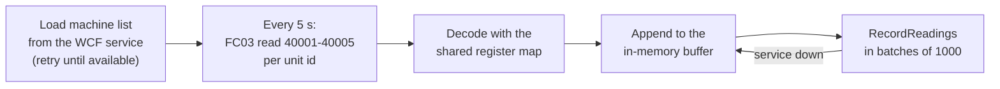

# 6. Modbus TCP and the edge gateway

The plant floor does not speak HTTP. Cranes, saws, coating ovens and threaders expose a bank of
16-bit registers over **Modbus**, a protocol from 1979 that is still the lingua franca of
industrial equipment. This part of the project reads those machines and gets their data into the
same database as the inventory.

Two projects: `YardTracker.Modbus` (the protocol, no dependencies) and
`YardTracker.EdgeGateway` (the worker that polls and forwards).

## Why implement Modbus rather than take a library

Three reasons, all practical:

1. **Zero dependencies** on a component that would run as a Windows service on a plant network.
2. **It is genuinely small.** Two function codes and a 7-byte header is a few hundred lines.
3. **The details are testable and worth pinning.** Byte-exact frames, big-endian ordering,
   two's-complement temperatures and exception responses are where real integrations break, and
   `ModbusTests.cs` asserts every one of them.

## The wire format

Modbus TCP is a **PDU** (the protocol unit, unchanged since the serial version) wrapped in an
**MBAP** header that adapts it to TCP.

```
| Transaction id (2) | Protocol id = 0 (2) | Length (2) | Unit id (1) | Function (1) | Data (n) |
|<------------------------- MBAP header, 7 bytes --------------------->|<----- PDU --------->|
```

All multi-byte fields are **big-endian**.

| Field | Purpose |
|---|---|
| Transaction id | Echoed by the server; lets a master match a response to its request |
| Protocol id | Always 0 for Modbus |
| Length | Byte count that follows — the unit id counts, hence `PduLength => Length - 1` |
| Unit id | Which device. On TCP this addresses a slave behind a TCP-to-RTU gateway |

`ModbusFrame.cs` is the whole codec. `Build` composes a frame; `ReadHeader` decodes one;
there are request builders and response parsers for the two function codes used:

| Function | Code | Use here |
|---|---|---|
| Read Holding Registers | `0x03` | Read a machine's five-register status block in one request |
| Write Single Register | `0x06` | Write 1 to the fault-reset register to acknowledge a fault |

An **exception response** sets the high bit of the function code (`0x03` becomes `0x83`) and
carries one byte of reason. `ModbusException` surfaces it as a typed .NET exception:

| Code | Meaning | Raised when |
|---|---|---|
| `0x01` | Illegal function | An unsupported function code |
| `0x02` | Illegal data address | The request runs past the register bank |
| `0x03` | Illegal data value | Read quantity is 0 or over 125 |
| `0x0B` | Gateway target device failed to respond | Unknown unit id |

The critical property, enforced in the client and covered by a test: **an exception response is
an application-level answer, so the TCP connection stays open.** Only a socket error drops and
reconnects. Getting that backwards produces a gateway that thrashes its connection every time one
device is briefly unavailable.

## The machine register map

One status block per machine, read with a single FC03 request (start 0, quantity 5). The `4xxxx`
numbers are the conventional one-based PLC register numbers; the wire uses zero-based addresses.

| Register | Address | Type | Meaning |
|---|---|---|---|
| 40001 | 0 | int16 | Temperature in tenths of °C (`2324` = 232.4 °C; `0xFF83` = −12.5 °C) |
| 40002 | 1 | uint16 | State: 0 Offline, 1 Idle, 2 Running, 3 Fault, 4 Maintenance |
| 40003 | 2 | uint16 | Cycle counter, **high** word |
| 40004 | 3 | uint16 | Cycle counter, **low** word |
| 40005 | 4 | uint16 | Vendor fault code (0 = none) |
| 40011 | 10 | uint16 | Write 1 (FC06) to acknowledge and clear a fault |

Three encoding conventions here are exactly what real PLCs do, and each is a place integrations
go wrong:

- **Scaled integers.** Modbus registers hold no floats, so temperature is tenths of a degree in a
  signed 16-bit register. `MachineRegisterMap.Encode` clamps and casts
  (`unchecked((ushort)(short)tenths)`); `Decode` reverses it (`unchecked((short)registers[0]) / 10.0`).
  Read it as unsigned and −12.5 °C becomes 6552.3 °C.
- **32-bit values split across two registers.** The cycle counter is reassembled as
  `(uint)high << 16 | low`. Word order is a per-vendor convention; this map documents its choice.
- **A writable command register.** Writing 1 to 40011 acknowledges a fault — the "write to act"
  idiom, rather than a separate command channel.

`Decode` is defensive: an undefined state value decodes to `Offline` rather than throwing, so a
firmware revision that adds state 5 degrades gracefully instead of taking the gateway down.
There is a test for that.

## The client (`ModbusTcpClient`)

A Modbus **master**. One TCP connection, one request at a time — which is what PLCs and serial
gateways expect — enforced by a `SemaphoreSlim`. A per-request `CancellationTokenSource` applies
the timeout.

Each transaction validates the response: protocol id 0, a plausible PDU length, and the
transaction id **and** unit id matching the request. A mismatch throws rather than being accepted,
which is what stops a late response to a previous request from being read as the answer to this
one — a real and nasty failure mode on a busy bus.

A timeout disconnects, so the next call reconnects cleanly. A `ModbusException` passes straight
through with the connection intact.

## The server (`ModbusTcpServer`)

A Modbus **slave**, used by the PLC simulator and by the loopback tests.

```csharp
public sealed class ModbusTcpServer(IPAddress bindAddress, int port, Func<byte, IModbusDevice?> resolveDevice)
```

Several unit ids share one listener via the `resolveDevice` delegate — exactly how a Modbus
TCP-to-RTU gateway fronts several serial devices on a production floor. An unknown unit id gets
`GatewayTargetDeviceFailedToRespond` (`0x0B`), the correct answer, rather than a dropped connection.

`HoldingRegisterDevice` is a thread-safe register bank implementing `IModbusDevice`. Its
`WriteSingleRegister` is `virtual`, which is how the simulator makes the status registers
read-only while still accepting a write to the fault-reset register.

## The edge gateway

`YardTracker.EdgeGateway` is a .NET generic-host worker with `AddWindowsService`, so the same
binary runs in a console for a demo and installs as a Windows service in production.

### Configuration (`appsettings.json`)

| Setting | Default | Purpose |
|---|---|---|
| `Service.BaseAddress` | `net.tcp://localhost:8523/YardTracker/` | The WCF service |
| `Modbus.Host` / `Port` | `127.0.0.1` / `5020` | The PLC endpoint. Real PLCs use 502; 5020 is the simulator |
| `Modbus.PollIntervalSeconds` | `5` | Sampling rate |
| `Modbus.TimeoutMilliseconds` | `1500` | Per-request timeout |
| `Modbus.MaxBufferedReadings` | `20000` | Store-and-forward ceiling |
| `Modbus.AutoResetFaultsAfterPolls` | `0` (off) | Demonstrates FC06 by clearing a fault after N consecutive faulted polls |

### The polling loop



Five design points, each with a reason:

**1. The machine list comes from the database, not from configuration.** `LoadMachinesAsync`
calls `GetMachinesAsync` and retries every five seconds until the service answers. Adding a
machine to the yard is then an `INSERT` into `telemetry.Machines`, not a config change and a
service restart on a box in a cabinet somewhere.

**2. Log state changes, not samples.** At one sample per machine per five seconds, logging every
reading produces noise nobody reads. The gateway logs only when a machine's state changes, and
separately when temperature crosses that machine's own alarm limit. A day of logs is then a
readable narrative of what the floor did.

**3. Store and forward.** If the WCF service is unreachable, readings stay in the buffer with
their **original timestamps** and are sent when it returns. This is the historian pattern, and it
is the same idea as the station's offline queue: never lose data because the middle tier restarted.
The buffer is capped at `MaxBufferedReadings` and drops oldest first, so a long outage degrades
into a gap in history rather than an out-of-memory crash.

**4. Failure handling is layered correctly.**

| Failure | Response |
|---|---|
| `ModbusException` from one device | Log a warning, carry on to the next machine. One bad device does not stop the poll |
| `IOException`, `SocketException`, `TimeoutException`, `InvalidDataException` | The whole connection is suspect: abandon this cycle and retry next tick |
| Connectivity failure to the WCF service | Buffer and keep polling |

**5. Edge-triggered connection logging.** `_plcReachable` and `_serviceReachable` flags mean the
gateway logs "connection failed" and "connection restored" once each, not once per poll. A
two-hour outage produces two log lines rather than 1440.

### Fault acknowledgement (FC06)

With `AutoResetFaultsAfterPolls > 0`, a machine that has been faulted for that many consecutive
polls gets a write of 1 to register 40011. It exists to demonstrate the write path end to end —
master writes, simulated PLC clears its fault, next poll shows the machine recovered. In
production that decision belongs to a human, which is exactly why the default is off.

## The PLC simulator

`YardTracker.Simulator plc` hosts a `ModbusTcpServer` with one `SimulatedMachineDevice` per
machine profile, on units 1-4 matching `telemetry.Machines` in the seed data.

Each device wraps a `MachineModel`: a state machine (offline, idle, running, fault, maintenance)
plus a first-order thermal response toward a target temperature, with noise and a cycle counter
that only advances while running. Faults arrive as a Poisson process with a per-machine mean time
between failures. The profiles are deliberately differentiated:

| Unit | Machine | Run temp | Utilization | MTBF | Character |
|---|---|---|---|---|---|
| 1 | CRN-N1 overhead crane | 64 °C | 55 % | 120 h | Intermittent |
| 2 | SAW-C1 band saw | 49 °C | 60 % | 90 h | Steady |
| 3 | OVN-C1 cure oven | 232 °C | 85 % | 160 h | High temperature, 5 % chance of a +22 °C overshoot |
| 4 | THR-C1 CNC threader | 55 °C | 90 % | 40 h | Runs flat out and faults often — **the plant's bottleneck** |

That last row is the point. The threader is configured to be the constraint, so the Flow &
Bottlenecks page in Power BI has something true to find: dwell time piles up at the threading bay.
The data tells a story rather than being random noise.

`--speedup 30` runs simulated time 30× faster, so state changes and faults are visible within a
demo rather than over a shift.

The full live chain:

```
Simulator plc (Modbus TCP server, port 5020)
    → EdgeGateway (FC03 every 5 s, decode, buffer)
        → WCF ITelemetryService.RecordReadings (batched TVP)
            → telemetry.usp_RecordMachineReadings
                → telemetry.MachineReadings
                    → Station Machines tab  /  rpt.vw_MachineReadingsHourly  →  Power BI
```

Next: [07-simulator.md](07-simulator.md)
