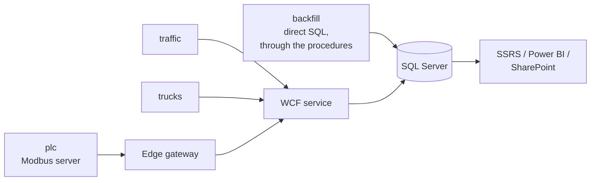

# 7. The simulator

`src/YardTracker.Simulator` is a single console application with four commands. Its job is to
make the system demonstrable and the reports meaningful without a real yard attached.

```
YardTracker.Simulator <command> [options]

  backfill   Generate N days of history directly in SQL Server
             --days 60  --seed 42  --connection "<connection string>"  --no-etl

  traffic    Live handheld scans through WCF
             --rate 1.0 (scans/sec)  --retry-chance 0.05

  trucks     Live truck deliveries with GPS pings through WCF
             --trucks 2  --trip-seconds 90  --ping-seconds 2

  plc        Modbus TCP server simulating yard machines (units 1-4)
             --bind 127.0.0.1  --port 5020  --speedup 30

Common: --security Transport|None  --seed 42
```

Every command takes `--seed` (default 42), so a run is reproducible. Two people following the
demo script see the same numbers.

## Why a simulator is part of the project, not a side script

Three things depend on it:

1. **Reports need history.** A throughput trend, an aging profile, a dwell-time distribution and
   a bottleneck are meaningless over an empty database or over uniform random noise. They need
   data with the right *shape*.
2. **The live path needs traffic.** Watching scans arrive, the fleet map move and machine
   temperatures climb is how you verify the whole chain end to end.
3. **The integration tests need the real rules applied.** `backfill` writes through the same
   stored procedures the WCF service uses, so every constraint, state transition and rejection
   path is exercised by generating the data.

## `backfill` — 60 days of history

A **discrete-event simulation**. A priority queue holds `(when, sequence) → action`; each action
may schedule follow-ups, and the whole queue is drained in time order. That is what produces
causally coherent history — a put-away happens after its receipt, a threading operation after the
delivery that brought the pipe.

It refuses to run against a database that already has items, and tells you to redeploy: history
generated on top of history would be incoherent.

### What a simulated day looks like

`PlanDay` schedules the day's work with realistic rhythm:

- **Sundays are empty.** Saturdays run at 35 % of a weekday. Each day also gets a random
  0.75-1.25 busyness multiplier. That is what gives the throughput chart a believable weekly
  cycle instead of a flat line.
- Receipts at North Yard and South Yard, check-outs at all three sites, weighted by site size.
- On weekdays, truck deliveries: North Yard → the Coating & Threading Plant, and back, plus an
  occasional plant → South Yard run.
- Zero to two deliberate bad scans.

Everything lands inside shift hours; `ShiftTime` and a next-shift guard push a follow-up that
would fall outside working hours to the start of the next shift.

### The flows it models

| Flow | What it produces |
|---|---|
| **Go-live stock take** | 70 / 35 / 12 items registered across the three sites on the first morning. Every yard starts with material already on the ground |
| **Receiving and put-away** | New material at a dock, then moved to a rack or laydown area. Some fails receiving inspection (MTR mismatch or damage) and goes to QA hold, released days later. Some is simply **forgotten on the dock** — which is what makes the overdue report have real content |
| **Check-out** | Mostly FIFO by heat number, as a yard actually works, with some jobs demanding a specific item. Some goes via outbound staging first |
| **Returns** | Material comes back unused and is checked in |
| **Truck deliveries** | Stage the load, depart, GPS breadcrumbs every ~3 minutes along the route, arrive, unload at the destination |
| **Plant processing** | Pipe goes through the coating line; casing and tubing through the threader — the slow step, which is what makes the bottleneck visible in the data |
| **Machine telemetry** | 15-minute samples over the whole period with shift patterns, faults and oven overshoots, bulk-inserted |

### The deliberate errors

`BadScanAsync` produces one of four realistic failures, so `dbo.ScanExceptions`, the SSRS
exception view, the SharePoint report and the Power BI exception rate all have genuine content:

| Case | Produces |
|---|---|
| A tag that was never registered (`YT-9xxxxx`) | `UnknownTag` — a barcode misread |
| Checking out an item that already left | `InvalidState` — a double check-out |
| Moving a North Yard item to a South Yard location | `WrongSite` — the rule that inter-site moves need a truck |
| Badge 1099, a former employee | `UnknownOperator` — the inactive badge in the seed data |

Plus a 2 % wireless-retry rate: the same `ClientScanId` sent twice, which exercises the
idempotency path and shows up in the summary as "retries deduplicated".

### Output

```
Scans accepted 12,043, rejected 118, retries deduplicated 241;
deliveries 96, GPS pings 4,812, machine readings 23,040;
312 items in yard (38s).
```

Unless `--no-etl` is passed, it then runs `etl.usp_LoadDailyInventoryMovement`, so the reporting
tables are populated and the reports work immediately.

## `traffic` — live handheld scans

Several virtual handhelds scanning through the WCF service, at `--rate` scans per second with
random jitter. The action mix is weighted like a real shift: 15 % receipts, 35 % moves, 20 %
check-outs, 10 % check-ins, 15 % lookups, and the remainder deliberate misreads. Site weighting
is 60 % North Yard, 25 % South Yard, 15 % plant.

A connectivity failure pauses for five seconds and retries; a `FaultException` is reported and
the loop continues — the same failure discipline the real client uses.

Use it to watch the service console log operations live, and to see the station's Inventory tab
change under you.

## `trucks` — live deliveries with GPS

One task per truck, cycling a fixed route set (North Yard → plant → South Yard → North Yard).
Each trip: select a load and call `StartDelivery`, then report `GpsPosition` along an interpolated
route at `--ping-seconds` intervals, then `CompleteDelivery` at the destination.

Trips are time-compressed (`--trip-seconds 90`) but reported speeds are realistic, so the fleet
map is watchable in a demo while the data stays plausible. Run it and open the station's
Fleet map tab to see trails being drawn.

## `plc` — the Modbus PLC simulator

Covered in [06-modbus-and-gateway.md](06-modbus-and-gateway.md). In short: a Modbus TCP server on
port 5020 exposing units 1-4, each running a thermal and state model, with the threader
deliberately configured as the plant's bottleneck.

## How the four fit together



`backfill` writes directly to SQL because generating 60 days through a live service would be slow
and would need the service running; it still goes through the stored procedures, so the rules are
identical. The other three go through the real network path, because demonstrating the *live*
behaviour is the whole point of them.

## Shared pieces

| File | Purpose |
|---|---|
| `Common.cs` | `Args` (a small `--name value` parser), `Out` (colour console logging with a lock), `Geo` (great-circle interpolation for GPS routes), `Catalog` (trucks, product mix, storage locations per site and category), and `Random` extensions such as `PickWeighted` and `Crew` |
| `MachineModel.cs` | The four machine profiles and the behavioural model, shared by `plc` and by the telemetry backfill so live and historical data have the same character |

Next: [08-etl-pipeline.md](08-etl-pipeline.md)
