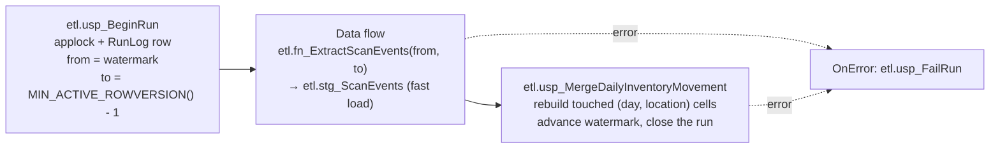

# 8. The ETL pipeline

The ETL turns `dbo.ScanEvents` — an ever-growing, insert-only event log — into
`rpt.DailyInventoryMovement`, a small summary table that reports can query instantly.

It is the most subtle part of the system, because it has to be correct in the presence of
**late-arriving data**: a handheld that was out of Wi-Fi range for two hours delivers scans whose
timestamps are hours old.

## Why summarise at all

The event log is the truth, but it is the wrong shape for reporting. "Tons received per day per
location for the last 90 days" over a million-row log, recomputed every time a dashboard refreshes,
is slow and gets slower. The summary is tiny, indexed on exactly the grain reports ask for, and
recomputed incrementally.

**Grain: business date × location × product category.**

| Measure | Meaning |
|---|---|
| `Receipts`, `CheckIns`, `CheckOuts`, `MovesIn`, `MovesOut`, `TruckLoads`, `TruckDeliveries` | Event counts by type and direction |
| `InboundEvents`, `OutboundEvents` | Totals by direction |
| `InboundTons`, `OutboundTons` | Weight, converted from pounds |
| `DistinctItems`, `DistinctOperators` | Cardinality |
| `FirstScanAtUtc`, `LastScanAtUtc` | The activity window |
| `LoadedByRunId`, `LoadedAtUtc` | Lineage: which run produced this row |

Each event contributes to **both** sides — an out at the origin location and an in at the
destination — which is what lets a report ask "what came into rack 3 today" and "what left dock 1
today" from the same table. Throughput therefore uses `MovesIn` only, so a move is counted once.

## The three problems and their solutions

### Problem 1: a timestamp watermark loses late data

The obvious incremental design is "load everything with `ScannedAtUtc` greater than last time".
It is wrong here. Device time is **not arrival order**. A handheld offline from 10:00 to 12:00
delivers 10:00-stamped scans at 12:00. If the 11:00 run already moved the watermark to 11:00,
those scans are never loaded. They are simply lost from reporting, silently.

**Solution: use `rowversion`.** `dbo.ScanEvents.RowVer` is a database-wide monotonically
increasing value assigned at **commit**, so it follows arrival order regardless of what the device
clock said. There is a unique index on it, so the range scan is a seek.

### Problem 2: a naive upper bound loses in-flight transactions

Take the current maximum rowversion as the upper bound and you can still lose rows. A transaction
that started earlier but has not committed yet holds a *lower* rowversion than rows already
committed after it. Read up to the current maximum and that transaction commits **behind** your
watermark — invisible forever.

**Solution:**

```sql
SET @ToRowVersion = CAST(MIN_ACTIVE_ROWVERSION() AS bigint) - 1;
```

`MIN_ACTIVE_ROWVERSION()` returns the lowest rowversion any open transaction could still use.
Everything below it is committed and final. Stopping there means nothing can appear behind the
watermark after it has been read.

### Problem 3: a late scan changes an old day's totals

A scan that arrives two days late belongs to a business day that was already summarised. Adding
it to today's totals would be wrong; ignoring it would be wrong too.

**Solution: rebuild the cells it touches, from the full log.**

The merge collects the distinct (business day, location) pairs the new events touch, deletes
exactly those cells from the fact table, and recomputes them **from `dbo.ScanEvents`** — not from
the staging batch. Delete plus insert in one transaction.

That makes the load **idempotent**: rerunning it over the same range produces identical rows, and
a scan two days late corrects that older day rather than being lost or double counted.

## The pipeline



### `etl.usp_BeginRun`

Opens a run and hands back the range. Inside one transaction it:

1. Takes `sp_getapplock 'etl.BeginRun'` with a 10-second timeout. Two concurrent runs would
   otherwise both read the same watermark and double-load.
2. Refuses to start if another run has been `Running` for under 30 minutes.
3. Marks any run still `Running` after 30 minutes as `Failed` with "Abandoned" — so a crashed
   package does not block the schedule forever.
4. Reads the watermark `WITH (UPDLOCK, HOLDLOCK)`, creating it at 0 on first run.
5. Computes `@ToRowVersion` as above, clamped so it can never go backwards.
6. Inserts the `etl.RunLog` row and returns `RunId`, `FromRowVersion`, `ToRowVersion`.

`@ReturnResultSet` exists because SSIS wants a result set to map into package variables, while the
T-SQL wrapper wants `OUTPUT` parameters. Same procedure, both callers.

### `etl.fn_ExtractScanEvents`

An inline table-valued function — the extract query, in one place:

```sql
WHERE se.RowVer >  CAST(@FromRowVersion AS binary(8))
  AND se.RowVer <= CAST(@ToRowVersion AS binary(8))
```

Exclusive lower bound, inclusive upper bound, so consecutive runs neither skip nor overlap. It
joins `Items` and `Products` to carry `ProductCategory` along, so the transform step does not have
to.

Being a function rather than a string literal is what lets the SSIS package and the T-SQL wrapper
share **exactly** the same extract logic.

### The staging step

SSIS truncates `etl.stg_ScanEvents` and runs an OLE DB source into a fast-load destination. The
T-SQL wrapper does `TRUNCATE` then `INSERT ... SELECT FROM etl.fn_ExtractScanEvents(@from, @to)`.

Staging is not strictly necessary for the stored-procedure path, but keeping it means both paths
hand the merge the same input, so the merge is genuinely shared and genuinely tested.

### `etl.usp_MergeDailyInventoryMovement`

The transform and load. It:

1. Validates the run is `Running` (`THROW 50102/50103` otherwise).
2. Builds `#touched`: distinct (business date, location) from the staged events, with

   ```sql
   CONVERT(date, (s.ScannedAtUtc AT TIME ZONE 'UTC') AT TIME ZONE st.TimeZoneId)
   ```

   Each event contributes both its from-location and its to-location via
   `CROSS APPLY (VALUES (FromLocationId), (ToLocationId))`.
3. Recomputes those cells into `#movement` **from `dbo.ScanEvents`**, not from staging, with
   `CROSS APPLY (VALUES ('Out', FromLocationId), ('In', ToLocationId))` to fan each event into its
   two directional contributions.

   The scan is bounded three ways for performance: a date window of
   `[@minDate - 1 day, @maxDate + 2 days)` to cover time-zone edges, `RowVer <= @toRowVersion` so a
   scan committed *during* this run cannot leak in, and the join to `#touched`.
4. Ensures `rpt.DimDate` covers the range.
5. In **one transaction**: delete the touched cells, insert the recomputed ones, advance the
   watermark, mark the run `Succeeded` with row counts.

The last point is the correctness guarantee: the watermark advances with the data or neither
happens. A failure halfway leaves the previous watermark and a `Failed` row in `RunLog`, and the
next run simply picks up where the last successful one stopped.

### Why not `MERGE`

Delete plus insert of a well-defined slice is easier to reason about, produces an obviously
idempotent result, and avoids the known concurrency and correctness pitfalls of T-SQL `MERGE`. The
slice is small — only the cells actually touched — so there is no performance argument for `MERGE`
either.

### `etl.usp_LoadDailyInventoryMovement`

The whole pipeline in T-SQL: begin, truncate, extract, merge, with a `CATCH` that rolls back,
calls `etl.usp_FailRun` and re-throws. This is what `scripts\Run-Etl.ps1` runs by default, what
the integration tests exercise, and what a SQL Agent job would schedule if SSIS is not in play.

## The SSIS package

`etl/ssis/YardTracker.ETL/DailyInventoryMovement.dtsx`

| Task | Type | Does |
|---|---|---|
| Begin run | Execute SQL | `etl.usp_BeginRun`, mapping the result set into the `RunId`, `FromRowVersion`, `ToRowVersion` variables |
| Truncate staging | Execute SQL | Clears `etl.stg_ScanEvents` |
| Extract scan events | Data Flow | OLE DB source over `etl.fn_ExtractScanEvents` (from the `ExtractQuery` expression) into an OLE DB destination in fast-load mode |
| Merge daily movement | Execute SQL | `etl.usp_MergeDailyInventoryMovement @RunId` |
| Mark run failed | OnError event handler | `etl.usp_FailRun` with the error message, so a failure is recorded even if the package aborts |

Variables: `ServerName`, `DatabaseName`, `RunId`, `FromRowVersion`, `ToRowVersion`, `ExtractQuery`.
The first two are overridable with `/Set` on the `dtexec` command line, which is how
`Run-Etl.ps1 -UseSsis` retargets it without editing the package.

The package uses the Microsoft OLE DB Driver 19 (`MSOLEDBSQL19`). Add it to an Integration
Services project with **Add Existing Package**, or run it with `.\scripts\Run-Etl.ps1 -UseSsis`.

**Status:** generated and structurally checked (lineage, paths, connections, precedence
constraints). **Not yet opened in the SSIS designer or run with `dtexec`.** The stored-procedure
path is the verified one.

## Running and monitoring

```powershell
.\scripts\Run-Etl.ps1            # stored-procedure path
.\scripts\Run-Etl.ps1 -UseSsis   # the SSIS package, if SSIS is installed
```

Either way the script prints the last five runs:

```
RunId RunSource  Status     StartedAtUtc         DurationMs RowsExtracted RowsWritten AffectedDays
----- ---------- ---------- -------------------- ---------- ------------- ----------- ------------
   14 StoredProc Succeeded  2026-09-12 11:58:02         412           183          64            3
```

Schedule it every 15 minutes with SQL Agent or Task Scheduler. `etl.RunLog` is what you alert on:
any row with `Status = 'Failed'`, or no `Succeeded` row in the last hour.

`AffectedDays > 1` is the late-data signal — it means scans arrived for days other than today,
which is exactly what you would expect from handhelds coming back into range.

## How the tests prove it

`DatabaseTests.Etl_is_incremental_and_rebuilds_days_touched_by_late_arriving_scans` is the test
that matters:

1. Record scans, run the ETL, assert the daily totals.
2. Record a scan **timestamped two days earlier** — simulating a handheld that was offline.
3. Run the ETL again.
4. Assert the older day's totals were corrected, and that today's were not double counted.

That single test covers the rowversion watermark, the touched-cell rebuild and idempotency
together.

Next: [09-reporting.md](09-reporting.md)
