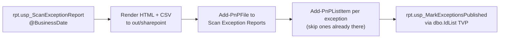
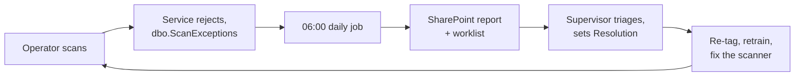

# 10. SharePoint and the operator SOP

The reporting layer answers "how are we doing". This layer closes the loop on a different
question: **what went wrong yesterday, and who is fixing it?**

Rejected scans are logged in `dbo.ScanExceptions` — but data nobody sees changes nothing. Every
morning a job publishes the previous day's rejections where supervisors already work, as a
readable report **and** a worklist they can assign and resolve.

## Why SharePoint

A supervisor will not open SQL Server Management Studio and will not keep a BI page open all day.
They live in SharePoint and Teams. Putting the exception list there means triage happens without
anyone learning a new tool — the report is a document they can forward, and the list is a
worklist with a status column.

It is also where the SOP belongs, so the procedure and the exceptions it explains sit in the same
site.

## `Provision-SharePoint.ps1` — the site structure

Run once per site, with PnP PowerShell (PowerShell 7.4+, and an Entra ID app registration whose
client id is passed with `-ClientId`).

```powershell
.\sharepoint\Provision-SharePoint.ps1 `
    -SiteUrl https://contoso.sharepoint.com/sites/yard `
    -ClientId 00000000-0000-0000-0000-000000000000
```

It creates three things:

| Artefact | Type | Columns | Purpose |
|---|---|---|---|
| **Scan Exception Reports** | Document library | Report date, Total exceptions, Open exceptions | Yesterday's HTML report and CSV extract, with the headline numbers as metadata so the library view is itself a summary |
| **Scan Exceptions** | List | Exception id, Occurred, Type (choice), Attempted action, Tag, Station, Operator, Details, Resolution (Open / Investigating / Resolved) | One item per rejected scan: the actual worklist |
| **Yard SOPs** | Document library | SOP number, Next review | Standard operating procedures, uploaded from `sharepoint/sop/` with the number parsed from the filename and a review date one year out |

Two details worth noting:

- **It is idempotent.** `Ensure-List` and `Ensure-Field` check before creating, so re-running it
  after adding a column is safe. Provisioning scripts that can only run on an empty site are
  provisioning scripts that get run once and then maintained by hand.
- **`ExceptionType` is a choice column** populated from the same nine values the database
  `CHECK` constraint allows. The list cannot drift from the data, and supervisors get a real
  filter rather than free text.

## `Publish-ScanExceptionReport.ps1` — the daily job

```powershell
# Local rehearsal, no tenant needed, Windows PowerShell 5.1 is fine
.\sharepoint\Publish-ScanExceptionReport.ps1 -LocalOnly

# The real thing
.\sharepoint\Publish-ScanExceptionReport.ps1 `
    -BusinessDate 2026-09-11 -SiteUrl https://contoso.sharepoint.com/sites/yard -ClientId <app id>
```

Defaults to **yesterday**, because it is meant to run early each morning after the ETL.

### What it does



**1. Extract.** One business day from `rpt.usp_ScanExceptionReport`. The day is the **plant
business day**, converted in SQL, so "yesterday" means the shift that ended, not a UTC window.

**2. Render.** A self-contained HTML report (inline CSS, no external assets, so it renders
anywhere and can be mailed) with two KPIs, a by-type summary and a detail table. Plus a CSV for
anyone who wants to pivot it themselves. Every field is HTML-encoded on the way out — `RawTag`
contains whatever the scanner produced, which is untrusted input by definition.

Both land in `out/sharepoint/` as `scan-exceptions-<date>.html` and `.csv`. This folder is
git-ignored; the repository contains one committed example from 2026-09-12 to show the output
shape.

**3. Upload** both files with the day's totals as library metadata.

**4. Create list items,** one per exception. Each one is checked first with a CAML query on
`ExceptionId`, so a re-run does not duplicate the worklist. Between this and the SQL-side
published marker, the job is safe to run twice.

**5. Mark published.** The ids go back to SQL in one call through the `dbo.IdList`
table-valued parameter, and `rpt.usp_MarkExceptionsPublished` stamps `PublishedAtUtc`. That column
is what guarantees an exception is never published twice, even across a changed date range.

### `-LocalOnly`

Runs steps 1 and 2 only, writes to `out/sharepoint`, and needs neither PowerShell 7 nor a tenant.
This is how the report is rehearsed and how the output in this repository was produced.

**Status:** run with `-LocalOnly`. Upload and provisioning have not been run against a tenant.

### Scheduling

Task Scheduler or SQL Agent, daily at about 06:00, **after** the ETL. The ETL is not strictly a
dependency — exceptions are read from `dbo.ScanExceptions` directly, not from the summary — but
running in that order means the day's reports and the day's exception list agree.

## The SOP

`sharepoint/sop/SOP-101-Scanning-Check-In-Check-Out.md` is the operator-facing procedure, written
for the person holding the handheld and not for a developer.

| Section | Covers |
|---|---|
| Before the shift | Collect a charged handheld, sign in by scanning your badge, check the **Online** indicator, check the device clock |
| Receiving | Verify the MTR heat number against the bundle stencil, tag, enter product / heat / pieces, scan, and send a mismatch to QA hold |
| Moving | Scan the `LOC:` rack label to set the target, then scan each bundle **as it is set down, not when it is picked up** |
| Issuing | Enter the work order or BOL, scan each bundle as it leaves. A red banner means do not ship it |
| Returns | Check in with a return location and reference |
| Rejected scans | A table mapping each banner to its meaning and the action to take |

Three things about it are worth calling out, because they are where software design meets floor
procedure:

**It tells operators that Offline is normal.** "You may keep scanning. Scans are stored on the
device and sync automatically, but tell the supervisor if it lasts more than 15 minutes." Without
that sentence, the first wireless dead spot produces a work stoppage or — worse — people writing
movements on paper and entering them later, which destroys the audit trail the system exists to
provide.

**It explains the clock check,** because `ClockSkew` is otherwise a baffling rejection. Knowing
*why* it happens is what lets an operator fix it instead of rescanning forever.

**"Scan as it is set down, not when it is picked up."** The database records the location an item
arrived at. Scanning on pickup would record an intention rather than a fact, and would leave items
recorded at a location they never reached if the move was interrupted.

The rejection table is the important half of the document, and it maps one-to-one onto the
`ExceptionType` values the database produces:

| Banner | Meaning | What to do |
|---|---|---|
| Unknown tag | Tag not registered or misread | Rescan. If it repeats, receive the item or re-tag it |
| Not allowed | Item is in the wrong state (already checked out, in transit) | Look it up and ask the supervisor |
| Wrong site | Location belongs to another site | Use a truck delivery |
| Already recorded | The handheld retried a scan | No action needed |

That last row is the whole idempotency design, explained to an operator in seven words.

## The loop this closes



The measurable outcome is the `Exception Rate` measure in Power BI. If the loop is working, it
trends down.

A natural next step, listed in the talking points as future work: a supervisor screen that writes
resolutions back from the SharePoint list into `dbo.ScanExceptions.ResolvedAtUtc` and
`ResolvedBy`, closing the loop in both directions.

Next: [11-build-run-test.md](11-build-run-test.md)
