YardTracker · inventory-asset-tracking-system

# Flow Atlas

Every workflow in the YardTracker system as a diagram: how pipe and steel bundles are scanned, trucked between sites, and watched by plant machines, and how that data reaches SSRS, Power BI and SharePoint. Each figure names the doc or source file it was drawn from.

## System

- [System overview](#overview)
- [Service contracts](#contracts)
- [Data model](#data-model)
- [Item state machine](#states)

## Floor workflows

- [Station session](#station)
- [One scan, end to end](#scan)
- [Offline scan replay](#offline)
- [Truck delivery](#delivery)
- [Machine fault](#telemetry)

## Back office

- [ETL run](#etl)
- [Reporting](#reporting)
- [Exception publishing](#sharepoint)
- [Exception feedback loop](#loop)

## Dev and ops

- [Simulator modes](#simulator)
- [Build and run order](#runbook)

## System what exists and how it connects

### System overview

Flowchart

Three kinds of floor device feed one WCF service. SQL Server enforces the rules, and everything downstream reads from it.

README.md · docs/architecture.md

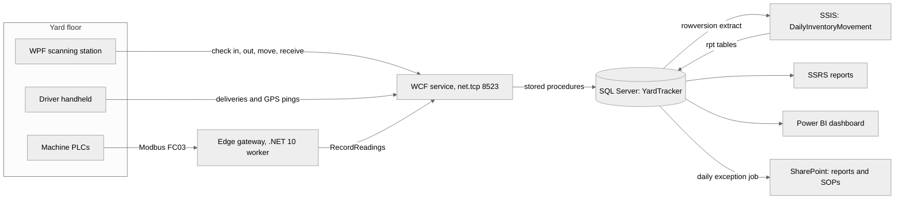

**Service ports**8523 for net.tcp, 8524 for metadata (MEX)

**PLC port**502 on real PLCs, 5020 for the simulator

**Security**Windows transport security: signed and encrypted

### Service contracts by consumer

Flowchart

Contracts are split by who calls them, not by table. A gateway has no channel that can move inventory.

docs/04-service-and-contracts.md · src/YardTracker.Contracts/ServiceContracts.cs

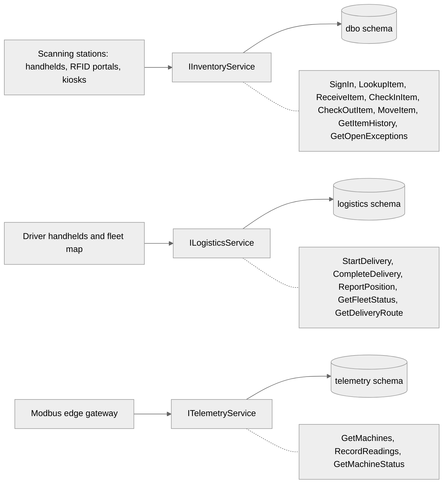

### Data model

ER diagram

`Items` holds current state. `ScanEvents` is the insert-only history of how each item got there.

docs/architecture.md · database/01_schema.sql

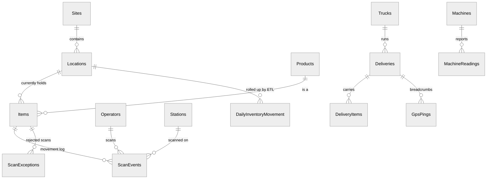

**dbo**Operational scans and items

**logistics**Trucks, deliveries, GPS

**telemetry**Machine readings from Modbus

**etl · rpt**Staging and control, then the reporting contract

### Item state machine

State diagram

Every scan is checked against these transitions. Anything else is rejected with a reason and written to `dbo.ScanExceptions`.

docs/architecture.md · database/02_operations.sql

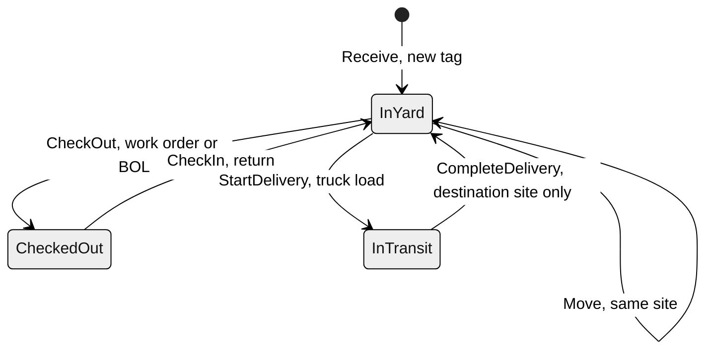

**Rejection reasons**UnknownTag, InvalidState, WrongSite, UnknownLocation, UnknownOperator, ClockSkew, DuplicateTag

## Floor workflows what happens on a device

### Station session

Flowchart

An operator signs in with a badge, then works from four tabs. The Scan tab has five modes.

docs/05-station-app.md · src/YardTracker.Station

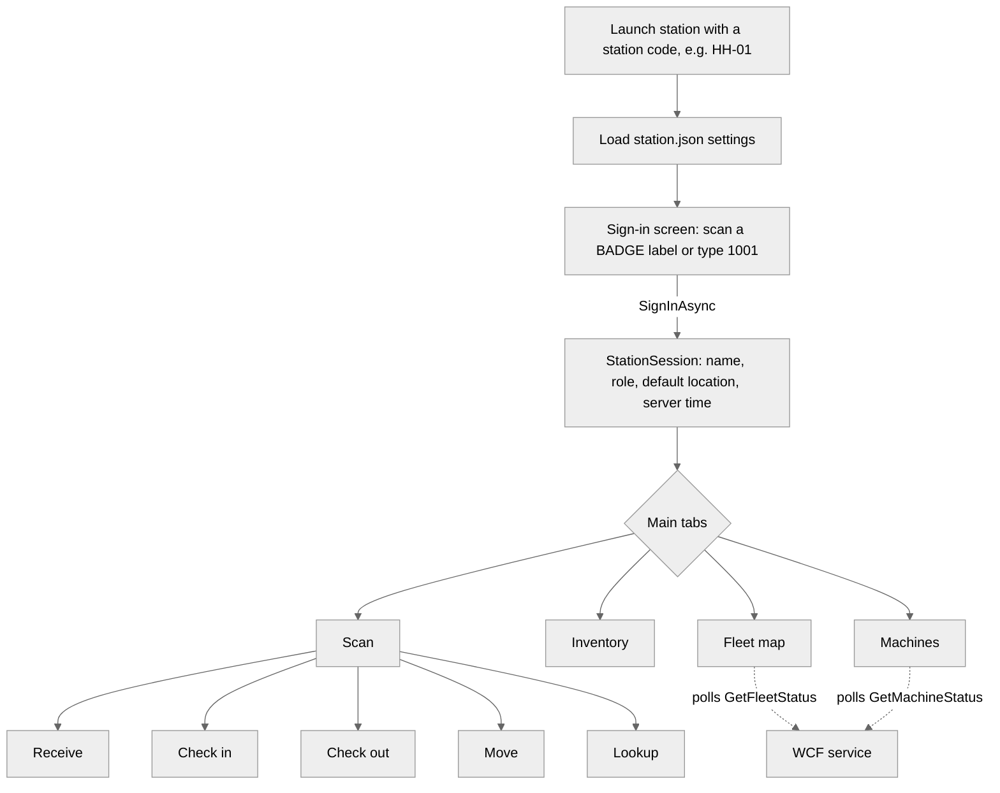

**Demo badges**1001 operator · 2001 supervisor · 3001 driver

**Scanner input**Keyboard-wedge reads are rerouted to the scan box if focus is elsewhere

### One scan, from tag to database

Sequence

An operator moves a bundle from the receiving dock to rack 3. The idempotency key is created on the device, and the database decides the outcome.

docs/12-end-to-end-walkthroughs.md, walkthrough 1

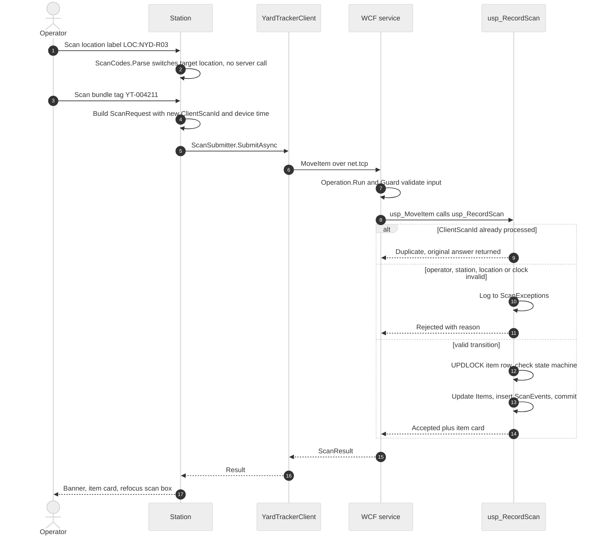

**Tag to database**A few milliseconds

**Tag to dashboard**One ETL cycle, about 15 minutes

### Offline scan replay

Sequence

With no Wi-Fi, scans queue on the device in order and replay later with their original IDs and timestamps. A lost reply cannot move an item twice.

docs/12-end-to-end-walkthroughs.md, walkthrough 2 · docs/05-station-app.md

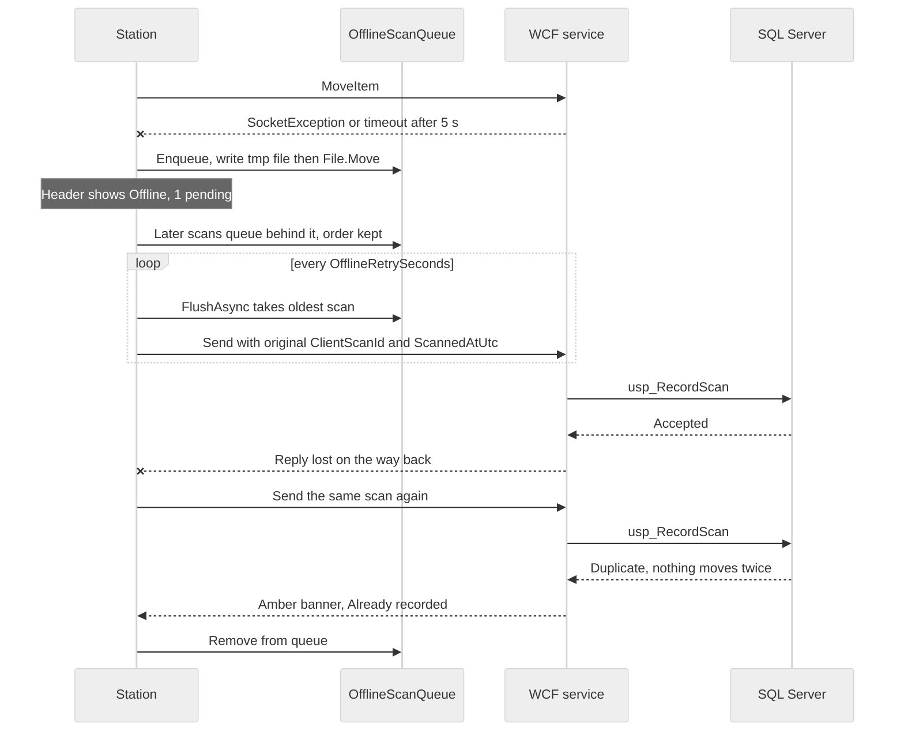

**Queue file**%LOCALAPPDATA%\\YardTracker\\offline-queue-\<station>.json

**Late data in ETL**The rowversion watermark still picks it up and rebuilds the day it happened

### Truck delivery between sites

Sequence

Three bundles go from North Yard to the Coating and Threading Plant. The whole load is validated at once, so a half-loaded truck cannot exist.

docs/12-end-to-end-walkthroughs.md, walkthrough 3

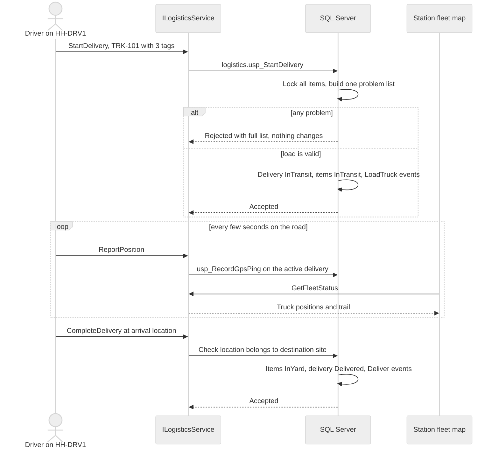

**Load checks**Unknown tag, not InYard, wrong origin site, truck busy, over MaxPayloadLbs

**One active load per truck**Enforced by the unique filtered index UX_Deliveries_ActivePerTruck

### Machine fault, PLC to dashboard

Sequence

The CNC threader trips at 02:14. The gateway polls it over Modbus TCP, logs the state change once, and forwards readings in batches.

docs/12-end-to-end-walkthroughs.md, walkthrough 4 · docs/06-modbus-and-gateway.md

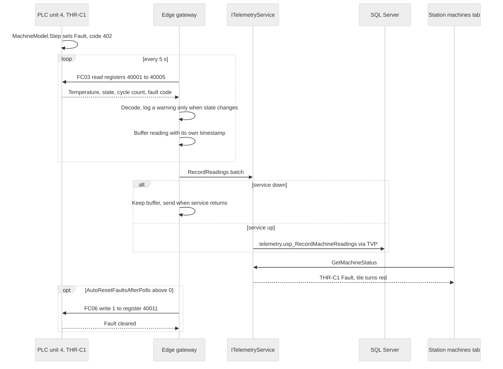

**Register 40001**Temperature in tenths of °C, 0x0226 = 55.0 °C

**Units**1 crane · 2 band saw · 3 cure oven · 4 threader

**Threader limits**Warn 65 °C, alarm 80 °C

## Back office what happens to the data

### ETL run: DailyInventoryMovement

Flowchart

Each run reads scan events committed since the last watermark and rebuilds only the (day, location) cells they touch. Reruns give the same result.

docs/08-etl-pipeline.md · etl/ssis · database/03_etl_reporting.sql

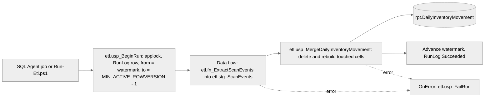

**Why rowversion**Device time is not arrival order, so a time watermark would skip late offline scans

**Grain**Business date × location × product category

**Moves**Counted as MovesOut at origin and MovesIn at destination

### Reporting

Flowchart

SSRS and Power BI read only the `rpt` schema, so the operational tables can change without breaking a report.

docs/09-reporting.md · reports/ssrs · powerbi

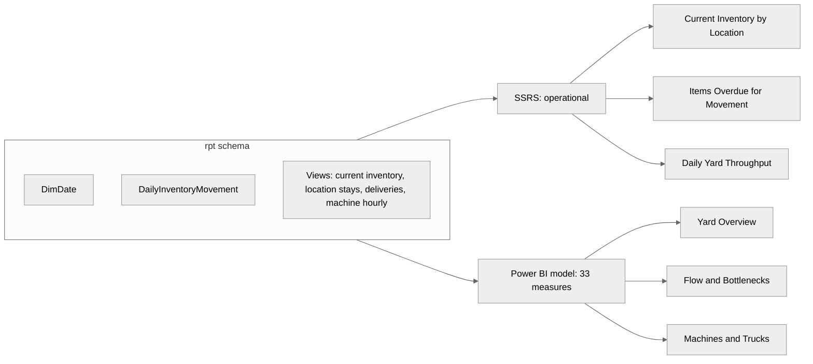

### Daily exception publishing

Flowchart

Each morning after the ETL, yesterday's rejected scans are published to SharePoint as a report and a worklist. Running it twice is safe.

docs/10-sharepoint-and-sops.md · sharepoint/Publish-ScanExceptionReport.ps1

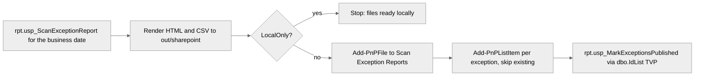

**Status**Run with -LocalOnly. Upload and provisioning have not been run against a tenant

### Exception feedback loop

Cycle

Rejected scans reach supervisors, who fix the cause. The Power BI `Exception Rate` measure shows whether the loop is working.

docs/10-sharepoint-and-sops.md · sharepoint/sop/SOP-101

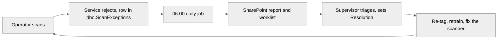

## Dev and ops running it locally

### Simulator modes

Flowchart

`backfill` writes straight to SQL through the same stored procedures. The live modes use the real network path.

docs/07-simulator.md · src/YardTracker.Simulator

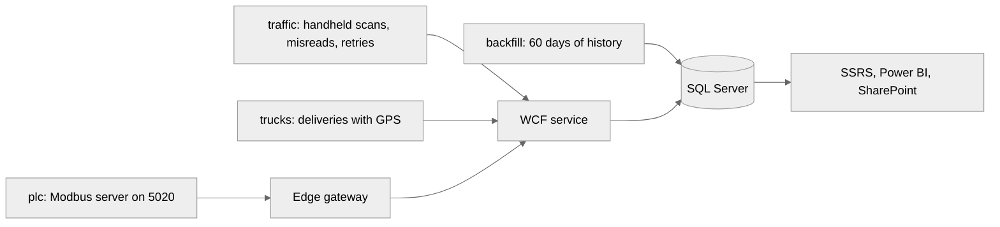

### Build and run order

Flowchart

The quick-start sequence from the README. Optional live feeds each run in their own terminal once the service is up.

README.md · docs/11-build-run-test.md

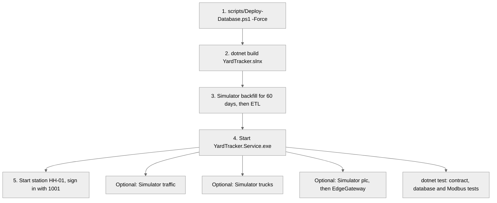

Drawn from the repository's docs/ folder and source tree. 15 diagrams: 4 system views, 5 floor workflows, 4 back-office flows, 2 dev and ops flows.