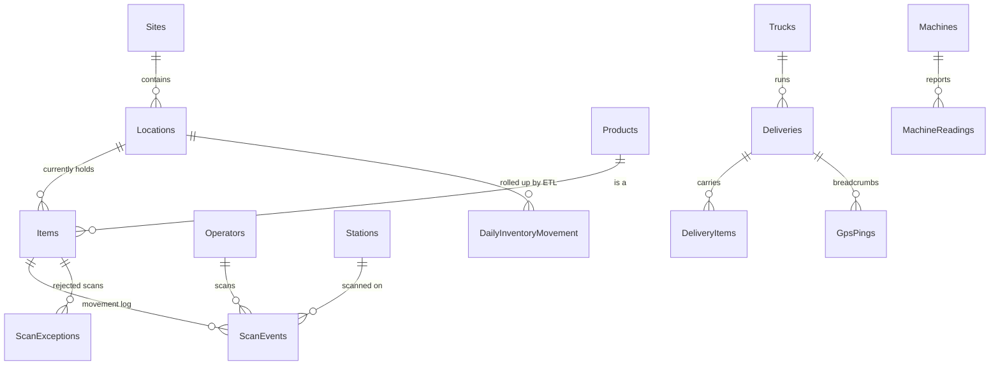
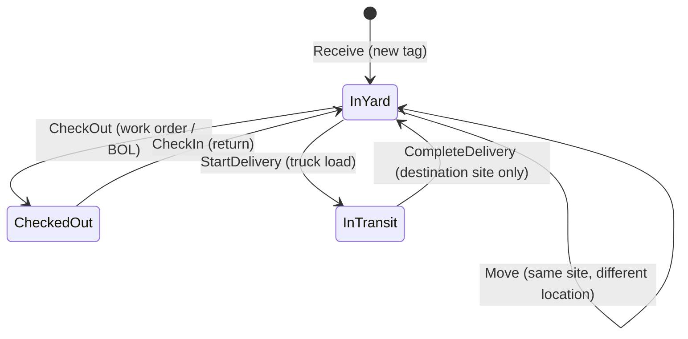
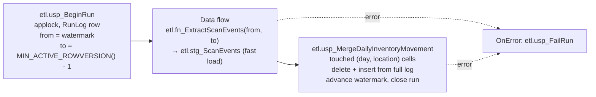

# Architecture

## Processes and ports

| Process | Runtime | Talks to | Port |
|---|---|---|---|
| `YardTracker.Service.exe` | .NET Framework 4.8 | SQL Server (ADO.NET, stored procedures) | listens TCP 8523 (`net.tcp`), 8524 (MEX) |
| `YardTracker.Station.exe` (one per device) | .NET 10 WPF | WCF service | client |
| `YardTracker.EdgeGateway.exe` | .NET 10 worker / Windows service | PLCs (Modbus TCP), WCF service | client (502 on real PLCs, 5020 for the simulator) |
| `YardTracker.Simulator.exe plc` | .NET 10 | none (Modbus server) | listens TCP 5020 |
| SSIS package / SQL Agent job | SSIS or T-SQL | SQL Server | none |
| SSRS / Power BI | | SQL Server | none |

## Data model

| Schema | Tables | Purpose |
|---|---|---|
| `dbo` | Sites, Locations, Operators, Stations, Products, Items, ScanEvents, ScanExceptions | Operational data. `Items` is current state; `ScanEvents` is the insert-only history |
| `logistics` | Trucks, Deliveries, DeliveryItems, GpsPings | Inter-site truck moves |
| `telemetry` | Machines, MachineStatuses, MachineReadings | Modbus readings |
| `etl` | Watermarks, RunLog, stg_ScanEvents | ETL control and staging |
| `rpt` | DimDate, DailyInventoryMovement + views | Reporting layer |

Every timestamp is stored in UTC. Business-day reporting converts with `AT TIME ZONE` using `Sites.TimeZoneId`, so a 9 pm scan in Houston counts for that day, not the next UTC day.

## Item state machine

Anything else is rejected with a reason (`UnknownTag`, `InvalidState`, `WrongSite`, `UnknownLocation`, `UnknownOperator`, `ClockSkew`, `DuplicateTag`) and written to `dbo.ScanExceptions`.

## Scan request lifecycle

1. The station parses the raw scanner text (`ScanCodes.Parse`): item tag, `LOC:` label, `BADGE:` label, or invalid.
2. It creates a `ScanRequest` with a new `ClientScanId` and the device clock (`ScannedAtUtc`).
3. `ScanSubmitter` sends it. On a connectivity failure (not a fault), the scan is appended to `%LOCALAPPDATA%\YardTracker\offline-queue-<station>.json` and replayed every 10 seconds, in order.
4. The service validates input and calls `dbo.usp_CheckInItem` / `usp_CheckOutItem` / `usp_MoveItem`, which all call `dbo.usp_RecordScan`.
5. `usp_RecordScan`:
   - Returns the original answer if `ClientScanId` was already processed (accepted or rejected).
   - Resolves the operator, station and location, and rejects device clocks more than 5 minutes ahead.
   - Locks the item row (`UPDLOCK, HOLDLOCK`), checks the transition, updates `Items` and inserts `ScanEvents` in one transaction.
   - A unique-key race on `ClientScanId` is caught and reported as `Duplicate`.
   - Logs rejections outside the transaction.
6. The result row includes the item's current details, so the station can show the item card without a second round trip.

## ETL: DailyInventoryMovement

- **Why rowversion instead of `ScannedAtUtc`:** device time is not arrival order. A handheld that was out of Wi-Fi range for two hours delivers old timestamps, and a time-based watermark would skip them.
- **Why `MIN_ACTIVE_ROWVERSION()`:** a transaction that is still open holds a lower rowversion than rows already committed after it. Stopping below the oldest active rowversion means nothing can commit into the range after it has been read.
- **Why rebuild touched cells:** a late scan changes an old day's totals. Recomputing the (day, location) cells it touches from the full event log is idempotent and self-correcting. A rerun over the same range produces the same rows.
- **Grain:** business date × location × product category. Moves count once as `MovesIn` at the destination and once as `MovesOut` at the origin. Throughput uses `MovesIn` so each move is counted once.

`scripts/Run-Etl.ps1` runs the stored-procedure version by default, or the SSIS package with `-UseSsis`.

## Modbus register map

One status block per machine, read with a single FC03 request (start 0, quantity 5). Each machine is a Modbus unit id on the same TCP endpoint.

| Register | Address (0-based) | Type | Meaning |
|---|---|---|---|
| 40001 | 0 | int16 | Temperature in tenths of °C (2324 = 232.4 °C, 0xFF83 = -12.5 °C) |
| 40002 | 1 | uint16 | State: 0 Offline, 1 Idle, 2 Running, 3 Fault, 4 Maintenance |
| 40003 | 2 | uint16 | Cycle counter, high word |
| 40004 | 3 | uint16 | Cycle counter, low word |
| 40005 | 4 | uint16 | Vendor fault code (0 = none) |
| 40011 | 10 | uint16 | Write 1 (FC06) to acknowledge and clear a fault |

| Unit | Machine | Warn / alarm |
|---|---|---|
| 1 | CRN-N1 overhead crane hoist motor | 85 / 100 °C |
| 2 | SAW-C1 band saw | 70 / 85 °C |
| 3 | OVN-C1 coating line cure oven | 245 / 260 °C |
| 4 | THR-C1 CNC pipe threader | 65 / 80 °C |

Exception responses: `0x02` illegal data address (outside the register bank), `0x03` illegal data value (quantity 0 or over 125), `0x01` illegal function, `0x0B` gateway target failed to respond (unknown unit id).

## WCF configuration notes

- `netTcpBinding` with `security mode="Transport"` and Windows credentials: signed and encrypted, no certificate to manage on a domain.
- Timeouts are short (`openTimeout` 5 s, `sendTimeout` 15 s), so a handheld fails fast and queues the scan instead of freezing.
- The metadata endpoint uses its own port. Without port sharing, all endpoints on one port need identical listener settings, and `mexTcpBinding` cannot match the tuned station binding.
- Throttling: 128 concurrent calls, 400 sessions.
- Production hosting options: a Windows Service wrapping the same `ServiceHost`, or IIS/WAS with `net.tcp` activation.

## Simulated data

`YardTracker.Simulator backfill` runs a discrete-event simulation through the same stored procedures the service uses:

- Go-live stock take, then daily receipts, put-away and QA holds.
- FIFO-biased check-outs, some via staging, and occasional returns.
- Truck deliveries North Yard → Coating & Threading Plant → back, with GPS breadcrumbs.
- Processing at the plant, where the threader is the bottleneck.
- Misreads, double check-outs, wrong-site moves and an inactive badge.
- 2% wireless retries.
- 15-minute machine telemetry with shift patterns, faults and oven overshoots.
